# StepFlow Usage Guide — Examples & Migration

This guide is **example-centric**: it shows how every node type is used inside real flows, how DataExchange profiles are built and invoked, ten end-to-end scenarios with full ASL JSON, and step-by-step migration procedures from SSIS packages and Azure Logic Apps.

Engine internals (canvas interface, state-type semantics, choice-rule operators, payload pipeline order, error handling) live in **[UserManual.md](UserManual.md)** — this guide cross-references it instead of duplicating it:

| Topic | UserManual section |
|---|---|
| State types & execution model | §3 |
| Resource schemes (narrative) | §4 |
| Choice rule operators | §5 |
| Data flow & payload handling (`InputPath` → `Parameters` → `ResultSelector` → `OutputPath`) | §6 |
| Error handling (`Retry`, `Catch`, built-in error codes) | §7 |
| Node categories overview | §8 |
| Running flows, saving/loading | §9–§10 |
| Importing legacy ASL flows from `Flows/` | §12 |

**Conventions used in this guide:**

- All ASL JSON uses **PascalCase keys** (`"Type"`, `"Resource"`, `"Next"`). The engine's Json.NET binding is case-insensitive, so lowercase variants (as found in converted flows under `Flows/`) also run — but new flows should standardize on PascalCase.
- Every ```json block in this document parses as valid JSON.
- REST examples target the main app's fixed dev port **`http://localhost:5001`** (`Program.cs` `UseUrls`; override with `ASPNETCORE_URLS`). Scenario flows that call `/api/Fake/*` endpoints additionally need the standalone fake test host on **`http://localhost:5095`** (`Stepflow-Builder-Tests/Program.cs`).
- **Payload templates** apply to `Parameters` and `ResultSelector` only (UserManual §6). In the default JSONPath mode a template property is written with a `.$` suffix on its name and a path as its value: `"orderId.$": "$.order.id"` resolves that JSONPath against the state's input; values starting with `$$` resolve against the execution context (`$$.Execution.StartTime`, `$$.State.Name`, …); any other string stays literal (the `States.Format('…', '$.a')` intrinsic is also supported). With `"QueryLanguage": "JSONata"` on the definition, the whole template object is evaluated as one JSONata expression instead — no suffix needed.

---

## 1. Architecture Overview

### 1.1 What the engine is

StepFlow Builder is a visual designer plus an execution engine for state machines written in an [Amazon States Language](https://docs.aws.amazon.com/step-functions/home.html) (ASL) dialect:

- **`StepFunctionInterpreter.cs`** walks the `States` dictionary, dispatching on each state's `"Type"`.
- **Task states** carry a `"Resource"` URI. The scheme selects the handler in **`CompositeResourceInvoker.InvokeAsync`** (`StepFunctions/ResourceInvoker.cs`, lines 66–110) — see §2 for all schemes.
- Every state shapes its payload through the same pipeline (UserManual §6): `InputPath` → `Parameters` → *(invoke)* → `ResultSelector` → `OutputPath`. The result is a **JToken** that becomes the next state's input.

### 1.2 State types

The engine's `StateType` enum (`StepFunctions/StatesLanguageModels.cs`) defines nine values:

| Type | Purpose |
|---|---|
| `Task` | Invoke a resource by URI scheme — the workhorse state (see §2) |
| `Pass` | Forward input unchanged; a named checkpoint for routing & debugging |
| `Choice` | Evaluate rules top-to-bottom; first match wins (UserManual §5) |
| `Wait` | Pause execution for a duration |
| `HumanTask` | Suspend until a person completes the task via API or file drop (§3.3) |
| `Succeed` | Terminate the workflow successfully with output data |
| `Fail` | Terminate the workflow with an error cause/message |
| `Parallel` | Run independent branches concurrently; all must complete |
| `Map` | Iterate over an array, running a sub-flow per item |

> UserManual §3 documents the eight core ASL types; `HumanTask` is managed by the human-task subsystem (task store + completion monitor) and appears in flows as its own state type.

### 1.3 Execution model

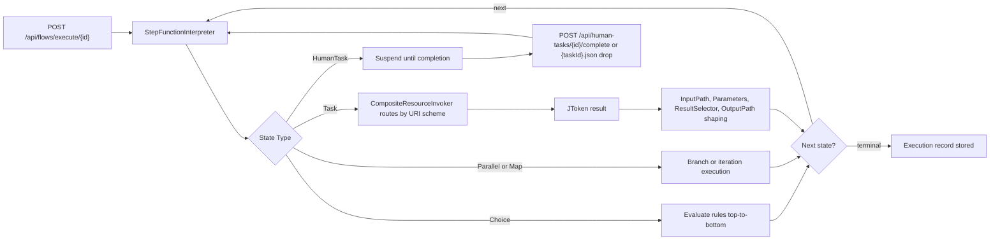

### 1.4 REST API routes

All routes below are verbatim from `Controllers/FlowsController.cs`, `Controllers/DataExchangeController.cs`, `Controllers/HumanTasksController.cs`, and `Controllers/WorkspaceController.cs`.

**Flows & executions (`FlowsController`)**

| Method | Route | Purpose |
|---|---|---|
| GET | `/api/ssh/hosts` | List curated SSH hosts (name/host/port only — never credentials) |
| POST | `/api/flows` (alias `/api/state-machines`) | Register/save a state machine definition |
| GET | `/api/flows` (alias `/api/state-machines`) | List registered state machines |
| GET | `/api/flows/{id}/definition` (alias `/api/state-machines/{id}`) | Get one state machine definition |
| POST | `/api/flows/execute/{id}` (alias `/api/state-machines/{id}/execute`) | Execute asynchronously; returns an execution id |
| POST | `/api/flows/execute-sync/{id}` | Execute synchronously and wait for the final output |
| GET | `/api/flows/executions/{id}` (alias `/api/execution/{id}`) | Get one execution's status/output |
| POST | `/api/state-machines/{id}/stop` | Stop an execution |
| GET | `/api/flows/executions` | List all stored executions (survives restarts; includes terminal history) |
| POST | `/api/flows/executions/{id}/resume` | Resume a stored execution (`Suspended`, or recovered-but-not-auto-resumed) |
| DELETE | `/api/flows/executions/{id}` | Delete a stored execution's checkpoint |
| POST | `/api/state-machines/save-project` | Save and compile as a multi-file Project Structure on local disk |
| POST | `/api/state-machines/load-project` | Load a multi-file Project Structure from local disk |

**DataExchange (`DataExchangeController`)** — full details in §4.5:

| Method | Route | Purpose |
|---|---|---|
| GET | `/api/data-exchange/profiles` | List all profiles |
| GET | `/api/data-exchange/profiles/{id}` | Get one profile by id or name |
| POST | `/api/data-exchange/profiles` | Save (create or update) a profile from its JSON document |
| DELETE | `/api/data-exchange/profiles/{id}` | Delete a profile by id or name |
| POST | `/api/data-exchange/execute` | Execute a profile synchronously. Body: `{ "profileId": "...", "input": { ... } }` |
| GET | `/api/data-exchange/executions?limit=50` | Recent execution artifacts (newest first) |
| GET | `/api/data-exchange/executions/{id}` | Single execution artifact by id |

**Human tasks (`HumanTasksController`)**:

| Method | Route | Purpose |
|---|---|---|
| GET | `/api/human-tasks?status=&executionId=` | List human tasks (filterable by status or executionId) |
| GET | `/api/human-tasks/{id}` | Get one task with its full payload and (if completed) result |
| POST | `/api/human-tasks/{id}/complete` | Complete a pending task; resumes or terminates the execution |

**Workspace (`WorkspaceController`) — org → project → sub-project hierarchy with per-node ACLs (§1.6)**:

| Method | Route | Purpose |
|---|---|---|
| GET | `/api/workspace` | Full tree (orgs → projects → sub-projects) with flow refs, profile ids and `unassignedProfiles` |
| POST | `/api/workspace/nodes` | Create a node. Body: `{ "name": "...", "parentPath"? }` → `{ path }`; parent must exist when given |
| POST | `/api/workspace/nodes/rename` | Rename in place. Body: `{ "path": "...", "newName": "..." }`; children + ACLs move with it |
| DELETE | `/api/workspace/nodes?path=…` | Recursively delete a node (404 when missing) |
| GET | `/api/workspace/access?path=…` | Local + effective grants for a node (effective = local ∪ ancestors, nearest wins per principal) |
| PUT | `/api/workspace/access?path=…` | Save the node's local ACL. Body: `{ "entries": [{ "principal", "role" }] }`; roles viewer/editor/admin/owner |
| GET/POST/DELETE | `/api/workspace/subprojects/{org}/{project}/{sub}/flows[/{flowId}]` | List / save / get / delete flows under a sub-project (save body: `{ name?, description?, id?, startAt?, states }`) |

**Typical curl session:**

```bash
# 1. Register a flow definition (ASL JSON file)
curl -X POST http://localhost:5001/api/flows \
  -H "Content-Type: application/json" \
  -d @my-flow.json

# 2. Execute synchronously with an input payload
curl -X POST http://localhost:5001/api/flows/execute-sync/{flowId} \
  -H "Content-Type: application/json" \
  -d '{ "order": { "amount": 250 } }'

# 3. Or execute asynchronously, then poll the execution record
curl -X POST http://localhost:5001/api/flows/execute/{flowId} \
  -H "Content-Type: application/json" \
  -d '{ "order": { "amount": 250 } }'

curl http://localhost:5001/api/flows/executions/{executionId}
```

### 1.5 MCP Server (AI agent interface)

The main app also exposes a **Model Context Protocol** server at **`/mcp`** (`Mcp/FlowTools.cs`, wired in `Program.cs`: `AddMcpServer().WithHttpTransport()` + `MapMcp("/mcp")`). Transport is streamable HTTP and stateless — no session handshake; every request is a plain JSON-RPC 2.0 POST (responses are framed as SSE). It exposes the same engine services as the REST routes above, so flows created via MCP load into the React canvas unchanged (camelCase ASL; dictionary keys keep their original casing).

**Client configuration** (Claude Desktop / VS Code Copilot / any MCP client):

```json
{
  "mcpServers": {
    "stepflow": {
      "url": "http://localhost:5001/mcp"
    }
  }
}
```

**Tools** (`FlowTools.cs`):

| Tool | Parameters | Returns |
|---|---|---|
| `list_flows` | — | Array of `{ id, name, description, updatedAt }` for every registered flow |
| `get_flow` | `idOrName` (string) | `{ id, name, description, createdAt, updatedAt, definition }`, where `definition` is the full camelCase ASL (`startAt`, `states`) |
| `save_flow` | `name` (string), `statesJson` (JSON string of the states object), `startAt?`, `description?` | `{ id, name, updatedAt }`. Upsert by name: saving again with the same name replaces the definition. Validates that `statesJson` parses, is non-empty, and that `startAt` (default: first key) names an existing state; dangling `next`/choice targets surface as errors at run time |
| `run_flow` | `idOrName` (string), `inputJson?` (JSON object string, default `{}`) | Synchronous execution result: `{ executionId, status, output, errorCode, errorMessage, history: [{ type, state, data }] }` |

All four tools return errors as JSON (`{ "error": "…" }`) rather than throwing, so agents can read and react to them. All nine `StateType`s (§1.2) — including `HumanTask` — are usable in definitions saved via MCP; a `run_flow` on a flow with a pending `HumanTask` returns status `Suspended`, and the execution resumes when the task is completed through §3.3's routes or file drop.

Manual call without an MCP client:

```bash
curl -s http://localhost:5001/mcp \
  -H 'Content-Type: application/json' \
  -H 'Accept: application/json, text/event-stream' \
  -d '{"jsonrpc":"2.0","id":1,"method":"tools/list"}'
```

### 1.6 Workspace hierarchy — organizing flows & profiles

The app organizes saved artifacts in a three-level tree — **organization → project → sub-project** — under the workspace root (`Workspace:RootDirectory` in `appsettings.json`, default `workspace-data`). Sub-projects are leaves and hold the files:

```
workspace-data/
└── Acme UI/                  ← organization (may carry access.json)
    └── Website/              ← project (may carry access.json)
        └── Web/              ← sub-project — the save target
            ├── flows/new-flow/{flow.json, meta.json}
            └── data-exchange/<profileId>/profile.json
```

**Access control.** Every node may have a local ACL (`access.json`) with entries `{ principal, role }` (roles: `viewer`, `editor`, `admin`, `owner`). A node's *effective* grants are the union of its own entries and those of all ancestors; when the same principal appears at several levels, the nearest ancestor wins. The Workspace panel shows both lists — local entries, and effective grants with an "inherited from …" label per grant.

**Using it in the UI.** Open the **Workspace** panel from the header: create/rename/delete orgs, projects and sub-projects; click a node's name to edit its ACL (add principal+role entries, then *Save Access*); select a sub-project as save target — "Save current canvas flow here" writes the canvas into that sub-project's `flows/`, and saved flows appear in the tree with an *Open* action.

**Migration.** On first start after upgrade, legacy flat profiles (`dataexchange/profiles/*.json`) are moved into `Default/Default/Default/data-exchange/<id>/profile.json` (idempotent; nothing is deleted). Registered flows keep their existing registry storage and can additionally be saved under any sub-project via the panel or the §1.4 workspace routes.

---

## 2. Resource Schemes (Task states)

A `Task` state's `"Resource"` URI is dispatched by scheme in `CompositeResourceInvoker.InvokeAsync` (`StepFunctions/ResourceInvoker.cs`, lines 66–110). The complete set of schemes, verbatim from that method:

| # | Scheme | URI form | Handler behavior (verbatim source) |
|---|---|---|---|
| 1 | `http://` | any absolute URL | `InvokeHttpAsync`: if input has `"__handler": "http"` → structured request (`method`, `body`, `query`, `auth{type,token}`; Bearer/OAuth tokens become an Authorization header; JSON body added except for GET/DELETE). Otherwise legacy: POST the entire input as the JSON body. Response is parsed as JSON; non-JSON responses come back wrapped as `{ "body": "<text>" }`. |
| 2 | `https://` | any absolute URL | Same handler as `http://` (single branch in source). |
| 3 | `rule://` | `rule://<ruleId>?eav=<entityName>` | NRules engine. With `?eav=` the input is mapped to a strict EAV dictionary via `_eavRegistry.MapPayloadToEav`; without it, legacy naive object mapping (`input.ToObject<Dictionary<string,object>>`). Returns the rule result JToken. |
| 4 | `rules://` | `rules://<workflowName>` | Microsoft RulesEngine: `_msRulesEngine.ExecuteWorkflow(workflowName, input)`; returns the workflow result as a JObject. |
| 5 | `transform://` | `transform://<operation>` | If operation is one of `javascript`, `python`, `powershell`, `csharp`, `shell` → routed to `ScriptExecutionService` (input keys: `script` + `input_data`). Any other operation → DuckDB transform with the URI operation overriding `input["operation"]`. DuckDB operations implemented in `DuckDbTransformService`: `query`, `filter`, `project`, `aggregate`, `sort`, `lookup`, `schema`, `sample`, `execute`. |
| 6 | `ai://` | any path (ignored) | POSTs the input to `{callbackBaseUrl}/api/ai/ask`; if the response has `"isError": true` the state fails with `States.TaskFailed` and the AI's error message. |
| 7 | `flow://` | `flow://<flowId>` | Synchronous sub-flow: `_stepService.ExecuteSyncAsync(flowId, input)`. If the child execution is `Failed`, throws `StepEngineException(execution.ErrorCode ?? "SubFlow.Failed", ...)`; otherwise returns `execution.Output`. |
| 8 | `tool://` | `tool://<name>` | POSTs to `{callbackBaseUrl}/api/tools/{name}/execute` via `InvokeHttpAsync` (structured or legacy body). |
| 9 | `internal://` | `internal://echo`, `internal://engine/status`, `internal://rules/status`, `internal://transform/status` | Built-in diagnostics: `echo` returns a deep clone of the input; the three `*/status` endpoints return engine status objects. Any other path throws `States.TaskFailed: Unknown internal resource`. |
| 10 | `dataexchange://` | `dataexchange://<profileId>` | Runs a DataExchange profile pipeline end-to-end: `_dataExchange.ExecuteAsync(profileId, input)` (§4). |
| 11 | `ssh://` | `ssh://<hostName>` | Curated host inventory (`ssh_hosts.json`) + AI safety check on the command. Command comes from static config or upstream input text; `"override": true` bypasses the harmful-command check; `timeoutSeconds` defaults to 30 (min 1). Output: `{ "host", "command", "exitCode", "stdout", "stderr", "durationMs" }`. |
| 12 | `fetch://` | `fetch://<hostName>?proto=scp\|sftp\|ftp\|xcopy` | Curated host inventory. Input: `sourcePath` (wildcards `* ?` where the protocol allows — SCP does not), `destDir`, `timeoutSeconds` (default 120). Output: `{ "host", "protocol", "sourcePath", "destDir", "files": [{ "remotePath", "localPath", "sizeBytes" }], "fileCount", "durationMs" }`. |

Any other scheme throws `StepEngineException("States.TaskFailed", "Unknown resource scheme: ...")`, which the state's `Retry`/`Catch` clauses (UserManual §7) can handle.

**Minimal Task state for each scheme:**

```json
{
  "CallApi": {
    "Type": "Task",
    "Resource": "https://api.example.com/orders",
    "Parameters": { "__handler": "http", "method": "POST", "body": { "orderId.$": "$.order.id" } },
    "Next": "Done"
  }
}
```

---

## 3. Node Catalog — All 25 Nodes in 12 Categories

Every node below is defined verbatim in `StepFlow-UI/src/schemas/steps/*.ts` (schemaId, config fields, defaults). The **ASL mapping** column shows how the canvas node appears in a flow's JSON `"States"` dictionary. Field tables list every `configFields` entry with its default; `required` marks fields whose validation rejects an empty value.

### 3.1 Terminal — START & END (2 nodes)

| Node | schemaId | ASL mapping |
|---|---|---|
| START | `stepflow:terminal:start` | Canvas-only entry marker (`isTemplate: false`). The flow's first state is named in the top-level `"StartAt"` property — there is no Start state type in ASL. |
| END | `stepflow:terminal:end` | Canvas-only exit marker. In ASL, completion is expressed by a terminal `Succeed` or `Fail` state (or an implicit end when a state has no `Next`). |

Both expose one config field — `description` (textarea, default `""`) — and no validation rules. START's single output port (`start_output`, "Flow entry point") carries the execution input into the first real state; END accepts any optional input.

```json
{
  "StartAt": "Greet",
  "States": {
    "Greet": {
      "Type": "Pass",
      "Next": "Done"
    },
    "Done": {
      "Type": "Succeed"
    }
  }
}
```

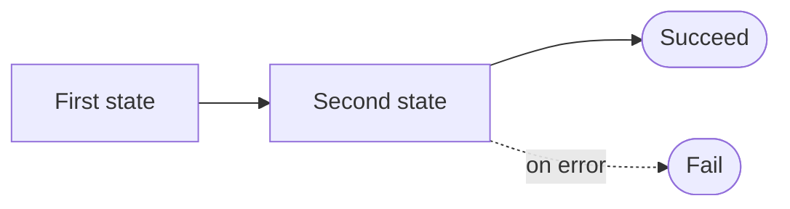

### 3.2 Flow — Choice, Map, Parallel, Succeed, Fail (5 nodes)

| Node | schemaId | ASL mapping |
|---|---|---|
| Choice | `stepflow:flow:choice` | `"Type": "Choice"` with a rules array (UserManual §5 operators) |
| Map | `stepflow:flow:map` | `"Type": "Map"` iterating an array, running a sub-flow per item |
| Parallel | `stepflow:flow:parallel` | `"Type": "Parallel"` with concurrent branches |
| Succeed | `stepflow:flow:succeed` | `"Type": "Succeed"` — terminal success |
| Fail | `stepflow:flow:fail` | `"Type": "Fail"` — terminal error |

**Choice** (`stepflow:flow:choice`) — "Conditional branching based on data comparisons. Route execution down different paths depending on conditions." Outputs: `output_true` (when the condition matches), `output_false` (otherwise).

| Field | Type | Default | Notes |
|---|---|---|---|
| `condition` | code | `""` | Expression that evaluates to true or false; required by validation |
| `defaultOutput` | dropdown | `output_false` | Options: True / False — which output fires when no rule matches |

```json
{
  "StartAt": "CheckAmount",
  "States": {
    "CheckAmount": {
      "Type": "Choice",
      "Choices": [
        {
          "Variable": "$.order.amount",
          "NumericGreaterThanEquals": 100,
          "Next": "FastTrack"
        }
      ],
      "Default": "StandardTrack"
    },
    "FastTrack": { "Type": "Pass", "Next": "Done" },
    "StandardTrack": { "Type": "Pass", "Next": "Done" },
    "Done": { "Type": "Succeed" }
  }
}
```

**Map** (`stepflow:flow:map`) — "Iterate over a dataset and run a sub-workflow for each item. Process collections in sequence." Input port `input_items` (array, required); output `output_results` (array of per-item results).

| Field | Type | Default | Notes |
|---|---|---|---|
| `targetFlowId` | text | `""` | **Required** — ID of a saved flow; its definition is **inlined into the state as `"Iterator"` at export time**, not called by ID at runtime (an unset/unknown target exports a placeholder Pass iterator) |
| `itemsPath` | text | `$.items` | JSON path to the array inside input (`"ItemsPath"` in ASL; must resolve to an array or the state fails with `States.Runtime`) |
| `maxConcurrency` | number | 1 | Min 1, max 50 — exported but **ignored by the engine**: all items start concurrently via `Task.WhenAll` |
| `resultPath` | text | `$.results` | Where the per-item result array is written (`"ResultPath"` in ASL; omit it and results replace input) |

Engine semantics (verified against `ExecuteMapState`): each item runs the inline `"Iterator"` state machine with a deep clone of itself as its own execution's input. The JArray of per-item outputs then flows through `ResultSelector → ResultPath → OutputPath`.
```json
{
  "StartAt": "ProcessItems",
  "States": {
    "ProcessItems": {
      "Type": "Map",
      "Next": "Done",
      "ItemsPath": "$.items",
      "ResultPath": "$.results",
      "Iterator": {
        "StartAt": "ValidateItem",
        "States": {
          "ValidateItem": {
            "Type": "Task",
            "Resource": "internal://echo",
            "Next": "ItemDone"
          },
          "ItemDone": { "Type": "Succeed" }
        }
      }
    },
    "Done": { "Type": "Succeed" }
  }
}
```

**Parallel** (`stepflow:flow:parallel`) — "Execute multiple branches concurrently and wait for all of them to complete." Input `input_data` (any, required); output `output_results` (array).

| Field | Type | Default | Notes |
|---|---|---|---|
| `numBranches` | number | 2 | Min 1, max 10 — how many branches the canvas renders |
| `timeout` | number | 300 | Canvas-only: a state-level `"TimeoutSeconds"` is **ignored on Parallel** (only Task states honor it); bound the whole run with top-level `"TimeoutSeconds"` on the definition instead (`States.Timeout`) |
| `failOnBranchFailure` | toggle | true | Canvas-only: no such flag exists in the engine — any branch failure always aborts the state, rethrowing that branch's error code/message (default `States.BranchFailed` / "A parallel branch failed") |

```json
{
  "StartAt": "FanOut",
  "States": {
    "FanOut": {
      "Type": "Parallel",
      "Next": "Done",
      "ResultPath": "$.branchResults",
      "Branches": [
        {
          "StartAt": "FetchCustomer",
          "States": {
            "FetchCustomer": { "Type": "Task", "Resource": "internal://echo" }
          }
        },
        {
          "StartAt": "QueryStock",
          "States": {
            "QueryStock": { "Type": "Task", "Resource": "internal://echo" }
          }
        }
      ]
    },
    "Done": { "Type": "Succeed" }
  }
}
```

**Succeed** (`stepflow:flow:succeed`) — "Terminate the workflow successfully with optional output data."

| Field | Type | Default | Notes |
|---|---|---|---|
| `outputData` | json | `{}` | **UI field only** — dumped into `"Parameters"`, which the engine ignores on Succeed; final output is simply the state's input after `"OutputPath"` (e.g. `"Done": { "Type": "Succeed", "OutputPath": "$.summary" }`) |

**Fail** (`stepflow:flow:fail`) — "Terminate the workflow with an error. Use to signal failure conditions."

| Field | Type | Default | Notes |
|---|---|---|---|
| `errorCause` | text | `Workflow failed` | **UI field only** — dumped into `"Parameters"`, which the engine ignores on Fail; ASL keys are `"Error"` (execution error code, default `States.TaskFailed`) and `"Cause"` (message, default `Task failed`) — custom codes require hand-written JSON |
| `errorMessage` | textarea | `""` | Same: ignored by the engine; use `"Cause"` in hand-written JSON |

```json
{
  "StartAt": "Validate",
  "States": {
    "Validate": {
      "Type": "Choice",
      "Choices": [
        { "Variable": "$.order.amount", "NumericGreaterThanEquals": 0, "Next": "Process" }
      ],
      "Default": "RejectOrder"
    },
    "Process": { "Type": "Pass", "Next": "Done" },
    "RejectOrder": {
      "Type": "Fail",
      "Error": "InvalidOrder",
      "Cause": "Order amount must be non-negative"
    },
    "Done": { "Type": "Succeed" }
  }
}
```

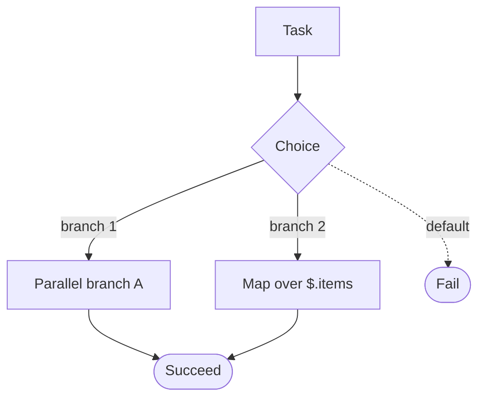

### 3.3 Human — Human Task (1 node)

**Human Task** (`stepflow:human:task`) — "Suspend the flow until a person completes an external action (approval, review, file drop). Completion arrives via `POST /api/human-tasks/{id}/complete` or by dropping `{taskId}.json` into the watched directory." Input port `input_data` (any, optional); output `output_data` ("The human's result — placed at Result Path, or replacing the input when unset").

| Field | Type | Default | Notes |
|---|---|---|---|
| `taskTitle` | text | — | **Required** — shown to the assignee in the task list; exported as `"Task": { "title" }` |
| `assignee` | text | — | Who should handle this (free-form); exported as `"Task": { "assignee" }` |
| `completionMethod` | dropdown | `api` | Options: `api` (POST `/api/human-tasks/{id}/complete`) / `file` (watch a directory for `{taskId}.json`); exported as `"Completion": { "Type" }` |
| `watchDirectory` | text | — | File mode only; defaults to `human-task-completions`; exported as `"Completion": { "Directory" }` when set |
| `resultPath` | text | — | Dotted path where the completion result is placed in the flow input (e.g. `approval`, or `$.approval`). Empty = replace entire input |

Engine contract (verified against `ExecuteHumanTaskState` / `CompleteHumanTaskAsync`): a HumanTask state **requires** `"Next"` or `"End": true`. On entry it creates an 8-hex-char `taskId`, persists the task record, checkpoints the execution as Suspended and advances to `Next`. When completed (API or file drop), the result is merged into the suspended input at `ResultPath` — empty path replaces the entire input — and the flow resumes from `Next`.
```json
{
  "StartAt": "RequestApproval",
  "States": {
    "RequestApproval": {
      "Type": "HumanTask",
      "Next": "CheckApproved",
      "Task": { "title": "Approve refund for order $.order.id", "assignee": "finance-team" },
      "Completion": { "Type": "api" },
      "ResultPath": "approval"
    },
    "CheckApproved": {
      "Type": "Choice",
      "Choices": [
        { "Variable": "$.approval.approved", "BooleanEquals": true, "Next": "ProcessRefund" }
      ],
      "Default": "DenyRefund"
    },
    "ProcessRefund": { "Type": "Pass", "Next": "Done" },
    "DenyRefund": { "Type": "Fail", "Error": "ApprovalDenied", "Cause": "Refund approval was denied" },
    "Done": { "Type": "Succeed" }
  }
}
```

Complete the task from a client:

```bash
curl -X POST http://localhost:5001/api/human-tasks/{taskId}/complete \
  -H "Content-Type: application/json" \
  -d '{ "approved": true, "comment": "Within policy" }'
```

```mermaid
flowchart LR
    T[Task] --> H[HumanTask - suspends the flow]
    H -->|POST /api/human-tasks/{id}/complete or file drop| C{Choice on $.approval}
    C -->|approved| P[Pass]
    C -.->|denied| F([Fail])
```

### 3.4 AI — Decision & Text Generation (2 nodes)

Both AI nodes call the engine's LLM endpoint (`ai://` scheme → `POST {callbackBaseUrl}/api/ai/ask`, §2 row 6). Shared fields: `model` (text, default `gpt-4-turbo`), `temperature` (slider, default 0.7, range 0–2 step 0.1), `llmService` (dropdown, default `azureOpenAI`; options `azureOpenAI`, `openai`, `anthropic`, `ollama`, `LmStudio`, `llamaCpp`, `openAiCompatible`, `saved`), `modelSource` (dropdown, default `node` — "Model setting (below)"; the `saved` option requires a saved local model config).

**AI Decision** (`stepflow:ai:decision`) — "Use an LLM to make a decision or classification based on input data." Input `input_data` (any, required); output `output_result` ("Decision", json).

| Field | Type | Default | Notes |
|---|---|---|---|
| `model` | text | `gpt-4-turbo` | **Required** |
| `prompt` | textarea | — | **Required** — the decision prompt; may reference input via JSONPath |
| `temperature` | slider | 0.7 | 0–2, step 0.1 |
| `llmService` / `modelSource` | dropdown | `azureOpenAI` / `node` | See shared fields above |
| `outputFormat` | dropdown | `json` | Options: json / text — json mode asks the model for a machine-readable result |
| `maxTokens` | number | 1000 | Cap on generated tokens |

**AI Text Generation** (`stepflow:ai:text`) — "Generate text using an LLM with system prompt and user input." Input `input_data` (any, required); output `output_text` ("Generated Text", string).

| Field | Type | Default | Notes |
|---|---|---|---|
| `model` | text | `gpt-4-turbo` | Model name for the selected service |
| `systemPrompt` | textarea | — | **Required** — system-level instructions |
| `temperature` / `llmService` / `modelSource` | — | as above | Shared fields |
| `maxTokens` | number | 2000 | Cap on generated tokens |
| `topP` | slider | 1.0 | Nucleus sampling, 0–1 step 0.05 |
| `stopSequences` | text | — | Comma-separated stop strings |

```json
{
  "StartAt": "ClassifyTicket",
  "States": {
    "ClassifyTicket": {
      "Type": "Task",
      "Resource": "ai://decision",
      "Parameters": {
        "model": "gpt-4-turbo",
        "llmService": "azureOpenAI",
        "prompt": "Classify the support ticket in the 'ticket' field as billing, technical, or other. Respond with JSON {\"category\": \"...\"}.",
        "outputFormat": "json",
        "ticket.$": "$.ticket"
      },
      "Next": "RouteByCategory"
    },
    "RouteByCategory": {
      "Type": "Choice",
      "Choices": [
        { "Variable": "$.category", "StringEquals": "billing", "Next": "BillingQueue" },
        { "Variable": "$.category", "StringEquals": "technical", "Next": "TechQueue" }
      ],
      "Default": "GeneralQueue"
    },
    "BillingQueue": { "Type": "Pass", "Next": "Done" },
    "TechQueue": { "Type": "Pass", "Next": "Done" },
    "GeneralQueue": { "Type": "Pass", "Next": "Done" },
    "Done": { "Type": "Succeed" }
  }
}
```

> **Embedding live data in prompts.** A plain prompt string is passed to the model verbatim — `$.ticket.subject` written inside it is *not* interpolated by the engine. To give the model live state input, bind it as a sibling parameter with the `"name.$": "$.path"` pattern (the value at that path is resolved against the state input and placed under `name` in the parameters), then reference it by name in the prompt — as above with `ticket.$`.

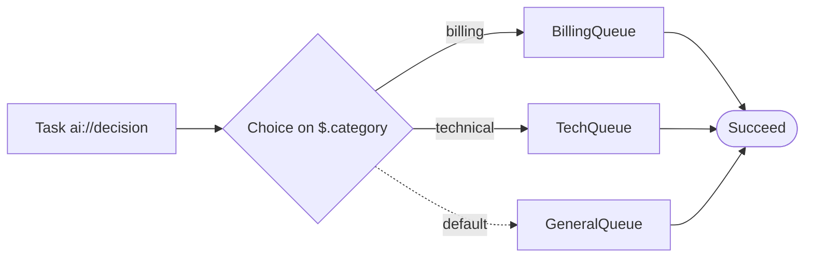

### 3.5 API — HTTP Request & Registered API (2 nodes)

**HTTP Request** (`stepflow:api:http`) — "Make HTTP requests to external APIs and services." Inputs: `input_body` (json, optional), `input_headers` (json, optional). Outputs: `output_response` ("API response body", json), `output_status` ("HTTP status code", number).

| Field | Type | Default | Notes |
|---|---|---|---|
| `method` | dropdown | `GET` | **Required** — options: GET, POST, PUT, PATCH, DELETE, HEAD |
| `url` | text | — | **Required**; validated as a parseable URL (`new URL(...)`) |
| `headers` | json | `{ "Content-Type": "application/json" }` | Request headers as JSON object |
| `timeout` | number | 30000 | ms; min 1000, max 120000 |
| `retryCount` | number | 0 | Min 0, max 5 — retry attempts on failure |
| `retryDelay` | number | 1000 | ms; min 100, max 30000; shown only when `retryCount > 0` |
| `authentication` | dropdown | `none` | Options: none / bearer / basic / apiKey / oauth2 |
| `authToken` | text | `""` | Shown only for `bearer`; becomes the Authorization header (see §2 row 1) |

In flow JSON this is a plain `http(s)://` Task state (§2 row 1). With `"__handler": "http"` in `Parameters` you get structured control over method, body, query and auth; without it the whole input is POSTed as the JSON body.

```json
{
  "StartAt": "CreateOrder",
  "States": {
    "CreateOrder": {
      "Type": "Task",
      "Resource": "https://api.example.com/orders",
      "Parameters": {
        "__handler": "http",
        "method": "POST",
        "body": {
          "customerId.$": "$.customer.id",
          "items.$": "$.order.items"
        },
        "auth": { "type": "bearer", "token": "{{API_TOKEN}}" }
      },
      "ResultSelector": { "orderId.$": "$.id", "status.$": "$.status" },
      "Next": "ConfirmOrder"
    },
    "ConfirmOrder": { "Type": "Pass", "Next": "Done" },
    "Done": { "Type": "Succeed" }
  }
}
```

**Registered API** (`stepflow:api:registered`) — "Call a pre-registered API from the API registry." Inputs: `input_params` (json, optional), `input_auth` (json, optional). Outputs: `output_response` (json), `output_errors` (array).

| Field | Type | Default | Notes |
|---|---|---|---|
| `apiId` | api-selector | — | **Required** — select a registered API from the registry |
| `endpoint` | dropdown | `""` | **Required** — options populated dynamically from the selected API |
| `timeout` | number | 30000 | ms; min 1000, max 120000 |
| `retryCount` | number | 0 | Min 0, max 5 |
| `enableCaching` | toggle | false | Cache API responses |
| `cacheTTL` | number | 300 | seconds; min 1, max 3600; shown only when caching is on |

The canvas node binds to a registry entry (`apiId` + `endpoint`) so individual nodes don't hardcode base URLs or auth context. In exported flow JSON the call appears as a standard `http(s)://` Task state (§2 row 1) targeting the URL resolved from that registry entry:

```json
{
  "StartAt": "LookupCustomer",
  "States": {
    "LookupCustomer": {
      "Type": "Task",
      "Resource": "https://crm.example.com/api/customers/{id}",
      "Parameters": {
        "__handler": "http",
        "method": "GET",
        "query": { "id.$": "$.customer.id" }
      },
      "Next": "Done"
    },
    "Done": { "Type": "Succeed" }
  }
}
```

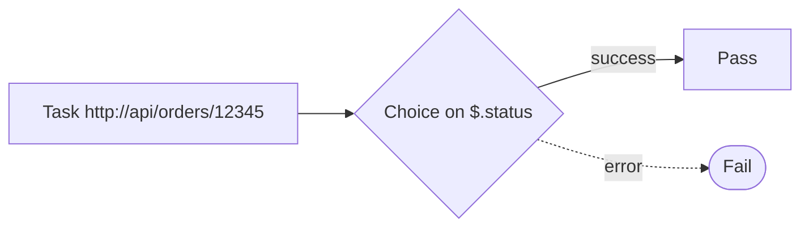

### 3.6 Rule — Rule Engine & MS RulesEngine (2 nodes)

**Rule Engine** (`stepflow:rule:rule_engine`) — "Evaluate business rules against input data to determine outcomes." Inputs: `input_data` (json, required), `input_context` (json, optional). Outputs: `output_result` ("Rule evaluation result", json), `output_matched` ("List of matched rule IDs", array).

| Field | Type | Default | Notes |
|---|---|---|---|
| `ruleSet` | code | `[{"name":"default","expression":"true","outcome":"pass"}]` (pretty-printed) | **Required** — JSON array of rules with expressions and outcomes; must parse to a non-empty array |
| `evaluationMode` | dropdown | `first_match` | Options: first_match / all_match / highest_priority |
| `defaultOutcome` | text | `pass` | Outcome when no rules match |
| `timeout` | number | 5000 | ms; min 100, max 60000 |
| `enableLogging` | toggle | false | Log rule evaluation details |

**MS RulesEngine** (`stepflow:rule:ms-rules`) — "Evaluate rules using Microsoft RulesEngine with C# expression support." Inputs: `input_data` (json, required), `input_workflows` (json, optional). Outputs: `output_result` (json), `output_errors` (array).

| Field | Type | Default | Notes |
|---|---|---|---|
| `ruleName` | text | — | **Required** — name of the rule to evaluate |
| `workflowName` | text | — | **Required** — name of the workflow containing the rule (becomes the `rules://<workflowName>` URI, §2 row 4) |
| `rulesDefinition` | code | MS-format JSON with one `default_rule` (`Expression: "input => true"`, success event `pass`) | **Required** — must be valid JSON in MS RulesEngine format |
| `enableDebug` | toggle | false | Detailed debug output |
| `timeout` | number | 10000 | ms; min 100, max 60000 |

**Result shapes (branch on these).** `rule://` returns NRules' `RuleResultEx`: `{ Status, HasErrored, ErrorMessage, ExecutedSql }` — branch on `$.HasErrored` / `$.Status`. `rules://` returns `RuleExecutionResult`: `{ workflowName, success, errorMessage, ruleResults: [{ ruleName, result, error, exception }], allPassed }` — branch on `$.allPassed` or `$.success`, as in the example below.

```json
{
  "StartAt": "ScoreCustomer",
  "States": {
    "ScoreCustomer": {
      "Type": "Task",
      "Resource": "rules://CreditWorkflow",
      "Parameters": {
        "customer.$": "$.customer",
        "orderAmount.$": "$.order.amount"
      },
      "Next": "RouteByScore"
    },
    "RouteByScore": {
      "Type": "Choice",
      "Choices": [
        { "Variable": "$.allPassed", "BooleanEquals": true, "Next": "AutoApprove" }
      ],
      "Default": "ManualReview"
    },
    "AutoApprove": { "Type": "Pass", "Next": "Done" },
    "ManualReview": { "Type": "Pass", "Next": "Done" },
    "Done": { "Type": "Succeed" }
  }
}
```

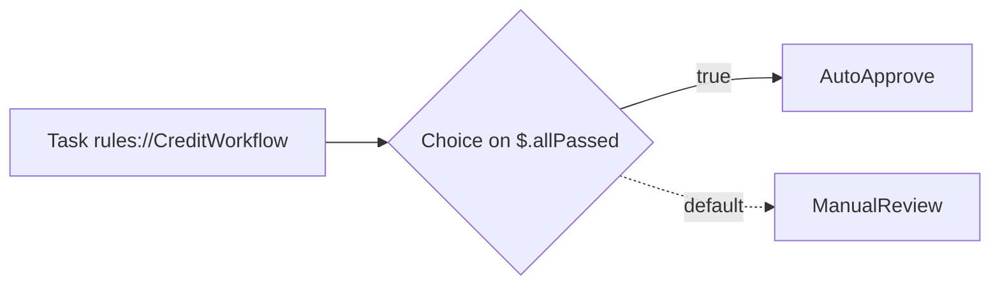

### 3.7 Data — SQL Query, DuckDB Query, EAV Operation (3 nodes)

**SQL Query** (`stepflow:data:sql`) — "Execute SQL queries against a database connection." Inputs: `input_parameters` (json, optional), `input_dataset` (array, optional). Outputs: `output_rows` ("Query result rows", array), `output_count` ("Number of rows returned", number).

| Field | Type | Default | Notes |
|---|---|---|---|
| `connectionString` | text | — | **Required** — database connection string |
| `query` | code | `SELECT * FROM table WHERE id = @id` | **Required** — use `@param` for parameters or `{{node.field}}` variables to reference upstream data |
| `outputColumns` | text | `""` | Comma-separated result columns (e.g. `"id, name"`); lets downstream nodes reference them as `{{this_node.column}}` |
| `commandTimeout` | number | 30000 | ms; min 1000, max 300000 |
| `enableCaching` | toggle | false | Cache query results |
| `cacheTTL` | number | 300 | seconds; min 1, max 3600; shown only when caching is on |

**DuckDB Query** (`stepflow:data:duckdb`) — "Execute SQL queries using DuckDB for in-memory analytics." Inputs: `input_data` (json, required), `input_config` (json, optional). Outputs: `output_result` ("Query result rows", array), `output_schema` ("Result schema metadata", json).

| Field | Type | Default | Notes |
|---|---|---|---|
| `query` | code | `SELECT * FROM data` | **Required** — runs against the input data; supports `{{node.field}}` variables from upstream nodes |
| `tableName` | text | `data` | Name to assign the input data as a table |
| `enableExtensions` | toggle | false | Enable DuckDB extensions (httpfs, parquet, etc.) |
| `maxRows` | number | 10000 | Min 1, max 1000000 |
| `outputColumns` | text | `""` | Comma-separated result columns for downstream `{{this_node.column}}` references |

**EAV Operation** (`stepflow:data:eav`) — "Entity-Attribute-Value operations for flexible data modeling. Inside a Map loop, row columns are picked from the parent flow's data source." Inputs: `input_entity` (json, required), `input_attributes` (json, optional). Outputs: `output_result` (json), `output_metadata` ("Operation metadata", json).

| Field | Type | Default | Notes |
|---|---|---|---|
| `operation` | dropdown | `read` | **Required** — options: read / write / update / delete |
| `entityType` | text | — | **Required** — e.g. `"customer"`, `"order"` |
| `attributeFilter` | text | `""` | Filter attributes by pattern (e.g. `"address.*"`) |
| `rowPath` | text | `$[0]` | Shown for read inside a Map loop; JSONPath of the row to read (default is the current item) |
| `columnSelector` | text | `""` | Shown inside a Map loop; comma-separated column names, or empty for all columns of the row |
| `entityTypeMapping` | text | `""` | Shown inside a Map loop; optional mapping from row column names to EAV entity types |
| `enableVersioning` | toggle | false | Track attribute changes over time |

```json
{
  "StartAt": "LoadOrders",
  "States": {
    "LoadOrders": {
      "Type": "Task",
      "Resource": "transform://query",
      "Parameters": {
        "operation": "query",
        "table": "orders",
        "sql": "SELECT id, amount FROM orders WHERE status = 'open'"
      },
      "Next": "Analyze"
    },
    "Analyze": {
      "Type": "Task",
      "Resource": "transform://aggregate",
      "Parameters": {
        "operation": "aggregate",
        "sql": "SELECT COUNT(*) AS openCount, SUM(amount) AS total FROM data"
      },
      "Next": "Done"
    },
    "Done": { "Type": "Succeed" }
  }
}
```

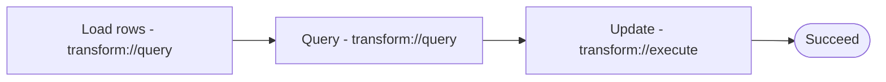

### 3.8 Transform — JSONata Processor & Script Execution (2 nodes)

**JSONata Processor** (`stepflow:transform:jsonata`) — "Transform data using JSONata expressions." Inputs: `input_data` (json, required), `input_context` (json, optional). Outputs: `output_result` ("Transformed data", json), `output_error` ("Expression error if any", string).

| Field | Type | Default | Notes |
|---|---|---|---|
| `expression` | code | `$map($$.input, function($v) { $v.processed = true; $v })` | **Required** — JSONata expression over the input data |
| `enableDebug` | toggle | false | Detailed debug output |
| `timeout` | number | 5000 | ms; min 100, max 60000 |

**Script Execution** (`stepflow:transform:script`) — "Execute custom scripts (JavaScript/Python) to transform data." Inputs: `input_data` (json, required), `input_env` (json, optional). Outputs: `output_result` ("Script output", json), `output_logs` ("Script execution logs", array), `output_error` (string).

| Field | Type | Default | Notes |
|---|---|---|---|
| `language` | dropdown | `javascript` | **Required** — options: javascript (Node.js) / python / powershell / csharp (Roslyn Scripting) / shell (Bash/CMD). These five names are exactly the operations that route to `ScriptExecutionService` under `transform://` (§2 row 5) |
| `script` | code | `// Access input via context.input\n// Return transformed data\nreturn { ...context.input, processed: true };` | **Required** — script body; access input via `context.input` and return the result |
| `timeout` | number | 10000 | ms; min 1000, max 120000 |
| `enableSandbox` | toggle | true | Run script in a sandboxed environment |
| `maxMemory` | number | 256 | MB; min 64, max 2048 |

```json
{
  "StartAt": "ShapePayload",
  "States": {
    "ShapePayload": {
      "Type": "Task",
      "Resource": "transform://javascript",
      "Parameters": {
        "script": "const o = context.input.order; return { id: o.id, total: o.items.reduce((s, i) => s + i.price * i.qty, 0), currency: o.currency };",
        "input_data.$": "$"
      },
      "Next": "Done"
    },
    "Done": { "Type": "Succeed" }
  }
}
```

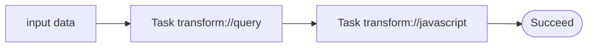

### 3.9 Utility — Pass Through, Wait, Branch (3 nodes)

| Node | schemaId | ASL mapping |
|---|---|---|
| Pass Through | `stepflow:utility:pass` | `"Type": "Pass"` — named checkpoint; input forwarded unchanged (§2 row 8) |
| Wait | `stepflow:utility:wait` | `"Type": "Wait"` with `SecondsDuration` / `SecondsPath` (§2 row 9); UI units (seconds/minutes/hours) are converted to seconds at export |
| Branch | `stepflow:utility:branch` | `"Type": "Choice"` for exclusive mode (§2 row 7). "Both Paths" mode has no single-state ASL equivalent — fan out with a `Parallel` state or two Choice branches instead. |

**Pass Through** (`stepflow:utility:pass`) — "Forwards input data to its output unchanged — a named checkpoint for routing & debugging (exports as an ASL 'Pass' state). Enable logging to capture the exact payload in this node's execution log." Inputs: `input_data` (any, required). Outputs: `output_data` ("Unmodified input data", any).

| Field | Type | Default | Notes |
|---|---|---|---|
| `label` | text | `""` | Optional label for identification |
| `enableLogging` | toggle | false | Capture the exact payload in this node's execution log (Info tab) and browser console during simulation |

**Wait** (`stepflow:utility:wait`) — "Pause execution for a specified duration." Inputs: `input_data` (any, required). Outputs: `output_data` ("Input data after wait", any), `output_timestamp` ("Timestamp after wait", string).

| Field | Type | Default | Notes |
|---|---|---|---|
| `duration` | number | 5 | **Required** — min 0, max 3600; must be a non-negative number |
| `durationUnit` | dropdown | `seconds` | Options: seconds / minutes / hours |
| `enableLogging` | toggle | false | Log wait start and end times |

**Branch** (`stepflow:utility:branch`) — "Branch execution based on a condition. Routes data to different paths." Inputs: `input_data` (any, required), `input_condition` (json, optional). Outputs: `output_true` ("Output when condition is true", any), `output_false` ("Output when condition is false", any), `output_both` ("Output to both paths (when enabled)", any — bottom port).

| Field | Type | Default | Notes |
|---|---|---|---|
| `condition` | code | `context.input.someField === true` | **Required** — expression evaluated for branching |
| `branchMode` | dropdown | `exclusive` | Options: exclusive (if-else) / both (Both Paths) |
| `enableLogging` | toggle | false | Log branch decisions |

```json
{
  "StartAt": "CheckBalance",
  "States": {
    "CheckBalance": {
      "Type": "Choice",
      "Choices": [
        { "Variable": "$.account.balance", "NumericGreaterThanEquals": 100, "Next": "Charge" }
      ],
      "Default": "Decline"
    },
    "Charge": { "Type": "Pass", "Next": "Done" },
    "Decline": { "Type": "Fail", "Error": "Insufficient balance", "Cause": "Balance below 100" }
  }
}
```

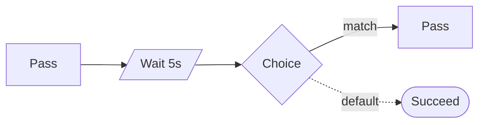

### 3.10 Remote — SSH Command (1 node)

| Node | schemaId | ASL mapping |
|---|---|---|
| SSH Command | `stepflow:ssh:command` | `"Type": "Task"` with `"Resource": "ssh://<hostName>"` (§2 row 10); the command goes in `Parameters.command`. Hosts come from a curated inventory (`ssh_hosts.json`) — arbitrary host names are rejected. |

**SSH Command** (`stepflow:ssh:command`) — "Connect to a curated remote host and execute a command. The command is AI-safety-checked before execution; enable Override to bypass." Inputs: `input` ("Input (command text)", string, optional). Outputs: `output` (json) with fields `host`, `command`, `exitCode`, `stdout`, `stderr`.

| Field | Type | Default | Notes |
|---|---|---|---|
| `host` | text | — | **Required** — curated host name from `ssh_hosts.json`; the resource URI becomes `ssh://<name>` |
| `command` | textarea | `""` | Optional static command. If empty and an upstream node is connected, the incoming input text is executed instead |
| `override` | toggle | false | Bypass the AI harmful-command check and issue any command |
| `timeoutSeconds` | number | 30 | SSH connect/execute timeout; min 1, max 600 |

```json
{
  "StartAt": "RestartService",
  "States": {
    "RestartService": {
      "Type": "Task",
      "Resource": "ssh://build-server-01",
      "Parameters": {
        "command": "systemctl restart stepflow-worker"
      },
      "ResultSelector": { "exitCode.$": "$.exitCode", "stdout.$": "$.stdout" },
      "Next": "VerifyHealth"
    },
    "VerifyHealth": { "Type": "Pass", "Next": "Done" },
    "Done": { "Type": "Succeed" }
  }
}
```

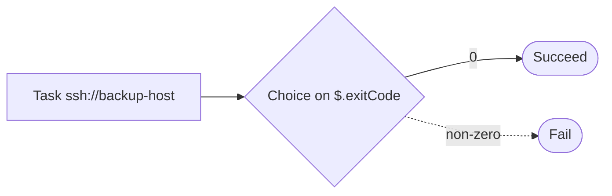

### 3.11 Transfer — Fetch Remote Files (1 node)

| Node | schemaId | ASL mapping |
|---|---|---|
| Fetch Remote Files | `stepflow:fetch:files` | `"Type": "Task"` with `"Resource": "fetch://<hostName>?proto=<protocol>"` (§2 row 11); `sourcePath`, `destDir`, `timeoutSeconds` go in `Parameters`. |

**Fetch Remote Files** (`stepflow:fetch:files`) — "Fetch files from a curated remote host via SCP, SFTP, FTP/FTPS or XCOPY (SMB). Wildcards (* ?) are supported where the protocol allows; files land in the local destination directory." Inputs: `input` (any, optional). Outputs: `output` (json) with fields `host`, `protocol`, `sourcePath`, `destDir`, `fileCount`.

| Field | Type | Default | Notes |
|---|---|---|---|
| `host` | text | — | **Required** — curated host name from `ssh_hosts.json`; the resource URI becomes `fetch://<name>?proto=<protocol>` |
| `protocol` | dropdown | `scp` | Options: scp / sftp / ftp (FTP/FTPS) / xcopy (XCOPY, SMB). XCOPY requires a Windows host with an SMB Share configured in `ssh_hosts.json` |
| `sourcePath` | text | — | **Required** — remote path or wildcard pattern (`* ?`). SCP does not support wildcards |
| `destDir` | text | — | **Required** — local directory where fetched files are written (created if missing) |
| `timeoutSeconds` | number | 120 | Transfer timeout; min 30, max 600 |

The engine's result additionally carries a `files[]` array (`remotePath`, `localPath`, `sizeBytes`) and `durationMs`:

```json
{
  "StartAt": "PullNightlyExports",
  "States": {
    "PullNightlyExports": {
      "Type": "Task",
      "Resource": "fetch://file-server-02?proto=sftp",
      "Parameters": {
        "sourcePath": "/exports/nightly/*.csv",
        "destDir": "dataexchange/inbox/customer-orders-import"
      },
      "ResultSelector": { "fileCount.$": "$.fileCount", "files.$": "$.files" },
      "Next": "Done"
    },
    "Done": { "Type": "Succeed" }
  }
}
```

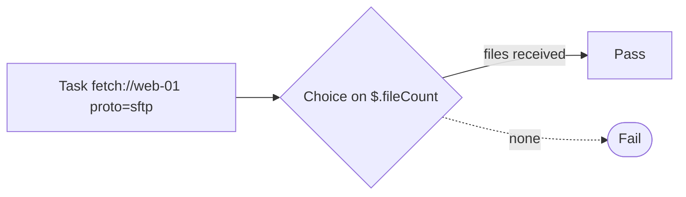

### 3.12 Subflow — Sub-Flow Call (1 node)

| Node | schemaId | ASL mapping |
|---|---|---|
| Sub-Flow Call | `stepflow:subflow:invoke` | `"Type": "Task"` with `"Resource": "flow://<targetFlowId>"` (§2 row 6); input/output mappings become the Task's `Parameters`. |

**Sub-Flow Call** (`stepflow:subflow:invoke`) — "Invoke another StepFlow workflow as a sub-flow with input/output mapping." Inputs: `input_data` (json, required), `input_context` (json, optional), `input_config` ("Config Override", json, optional). Outputs: `output_result` ("Sub-flow output", json), `output_status` ("Execution status and metadata", json), `output_errors` ("Any errors from sub-flow", array).

| Field | Type | Default | Notes |
|---|---|---|---|
| `targetFlowId` | dropdown | `""` | **Required** — select the target flow to invoke; options populated dynamically from registered flows |
| `targetFlowVersion` | dropdown | `latest` | Options: latest / pinned (specify) |
| `pinnedVersion` | text | `""` | Shown only when version is `pinned`; specific version to pin |
| `inputMapping` | json | `{ "input": "$.input_data" }` | **Required** — map this flow's inputs to the sub-flow's inputs (JSONPath); must be valid JSON |
| `outputMapping` | json | `{ "result": "$.output_result" }` | **Required** — map sub-flow outputs to this flow's outputs (JSONPath); must be valid JSON |
| `timeout` | number | 60000 | ms; min 1000, max 300000; must be positive |
| `errorMode` | dropdown | `propagate` | Options: propagate / continue_with_default (Continue with Default) / retry |
| `retryCount` | number | 0 | Shown only for `retry`; min 0, max 5 |
| `retryDelay` | number | 5000 | ms; shown only for `retry`; min 1000, max 60000 |
| `enableLogging` | toggle | true | Log sub-flow execution details |

```json
{
  "StartAt": "RunEnrichment",
  "States": {
    "RunEnrichment": {
      "Type": "Task",
      "Resource": "flow://customer-enrichment-v2",
      "Parameters": {
        "input.$": "$.customer"
      },
      "ResultSelector": { "enrichedCustomer.$": "$.result" },
      "Next": "Done"
    },
    "Done": { "Type": "Succeed" }
  }
}
```

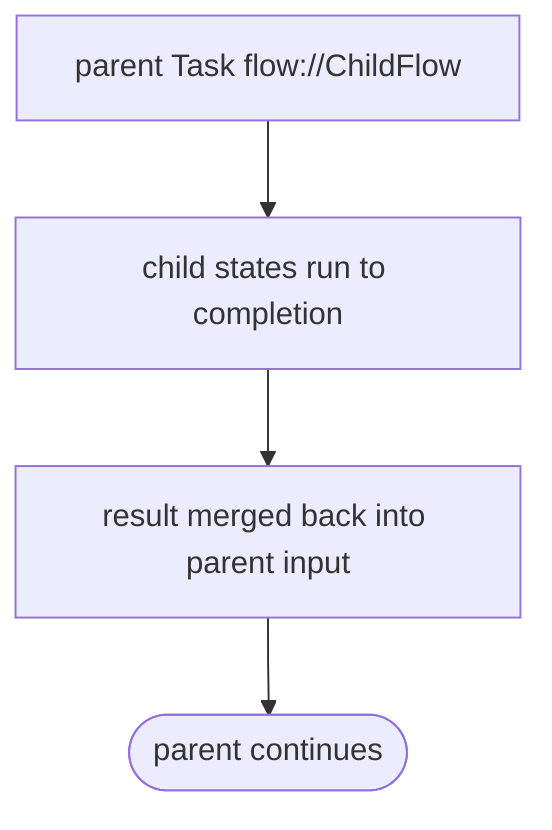

## 4. DataExchange Profiles

A **DataExchange profile** is a reusable, file-based data pipeline: it declares where rows come from (`DataSource`), what happens to them (`Pipeline` of staged `Action`s), and optionally how it gets triggered. Profiles are stored as JSON documents under their workspace sub-project (`<sub>/data-exchange/<profileId>/profile.json`; §1.6) and executed either synchronously by a flow, via REST, or automatically when a file lands in the profile's inbox folder.

### 4.1 Anatomy

Top-level fields (`DataExchangeProfile`):

| Field | Notes |
|---|---|
| `DataExchangeProfileName` | Display name of the profile |
| `ProfileId` | Stable file-based identity used by `dataexchange://<profileId>` URIs; defaults to a slug of the name |
| `FlowId` | Optional StepFlow state-machine id this profile is registered under (file-monitor trigger) |
| `IsActive` | Default `true`; inactive profiles are skipped by the file monitor and not executed on drop |
| `DataSource` | Where rows come from — see below |
| `Pipeline` | What happens to the rows — see below |

**`DataSource`** fields:

| Field | Notes |
|---|---|
| `DataSourceName` | Name of the source (e.g. a file name) |
| `MediumType` | One of `Api`, `ApiOAuth`, `Database`, `File` |
| `MediumConfigurationJson` | JSON **string** with medium-specific settings — e.g. `{ "filePath": "..." }` for `File` |
| `ImportSchemaId` / `ImportSchema` | Optional import schema (attribute domain) describing the source columns |

**`Pipeline`** fields: `PipelineName`, `Description`, and an ordered list of **stages**. Each stage has a `StageType` (`DataTreatment`, `PreRouting`, `Routing`, `PostRouting`), an `ExecutionOrder`, and its own ordered list of actions. Each action has an `ExecutionOrder` and an `Action` object whose `Type` selects the behavior:

| Action type | Behavior (from the enum docs) | Key fields |
|---|---|---|
| `Logic` | "Executes a function that performs validation, calculation or other logic. The return value depends on the Function Type." (`RuleType`: Validation → boolean, Calculation → calculated value, Selection → string/object for routing decisions) | rule definition fields |
| `Transformation` | "Transforms data from a source schema to a target schema using a map." | `SchemaMap.AttributeMappings[]` — each mapping has `TargetAttribute`, `SourceAttributes[]`, `TransformType`, `MergeStrategy` |
| `EnrichmentLookup` | "Enriches data by calling an external service (the endpoint). The result is added to the data row." | `OutputParameterName` (column the result lands in), `Lookup` = `{ LookupName, LookupEndpoint, Type: Api \| SqlDatabase, ValueFieldToReturn }` — `{...}` placeholders in the URL are filled per row |
| `Dispatch` | "Dispatches data to an external endpoint without expecting a response." | `Endpoint.ActionEndpointURL`, `Parameters` (e.g. `OutputFormat`, `Filter`) |
| `ExecutePipeline` | Runs another pipeline | — |

**`TransformType`** values for schema-map mappings: `DirectCopy` (copy one source field), `Combine` (join multiple fields with a `separator` parameter, e.g. `" "`), `Multiply` (multiply two fields), `SetDefault` (fixed value from a `defaultValue` parameter; sources ignored), `Trim`, `ToUpper`, `FormatDate` (`format` parameter, e.g. `"yyyy-MM-dd"`).

**`MergeStrategy`** values: `AddNewOnly` (default — only adds keys that don't already exist in the row; safest), `OverwriteExisting` (adds and overwrites existing keys), `AppendValue` (appends to existing value via string concatenation).

### 4.2 Using a profile in a flow

A profile is invoked from any Task state with the `dataexchange://<profileId>` resource (§2 row 12). The Task's input object is passed through as pipeline context; the result reports at least `success`, `rowsIn` and `rowsOut`:

```json
{
  "StartAt": "ImportOrders",
  "States": {
    "ImportOrders": {
      "Type": "Task",
      "Resource": "dataexchange://customer-orders-import",
      "Parameters": {},
      "ResultSelector": { "rowsIn.$": "$.rowsIn", "rowsOut.$": "$.rowsOut" },
      "Next": "Done"
    },
    "Done": { "Type": "Succeed" }
  }
}
```

### 4.3 REST API & file-drop trigger

Routes (all under `api/data-exchange`):

| Method | Route | Purpose |
|---|---|---|
| GET | `/api/data-exchange/profiles` | List all profiles |
| GET | `/api/data-exchange/profiles/{id}` | Get one profile by id or name |
| POST | `/api/data-exchange/profiles` | Save (create or update) a profile from its JSON document |
| DELETE | `/api/data-exchange/profiles/{id}` | Delete a profile by id or name |
| POST | `/api/data-exchange/execute` | Execute synchronously; body `{ "profileId": "...", "input": { ... } }` |
| GET | `/api/data-exchange/executions?limit=50` | Recent execution artifacts, newest first |
| GET | `/api/data-exchange/executions/{id}` | Single execution artifact by id |

**File-drop trigger.** `DataExchangeFileMonitorService` polls `<InboxDirectory>/<profileId>/` (default inbox: `dataexchange/inbox`) every `PollIntervalSeconds` (default 5). For each active profile whose `DataSource.MediumType` is `File`, a stable new file in that folder executes the profile with `{ "filePath": ... }` as input, records an execution artifact, and moves the source file to `processed/` or `failed/` so it is never reprocessed.

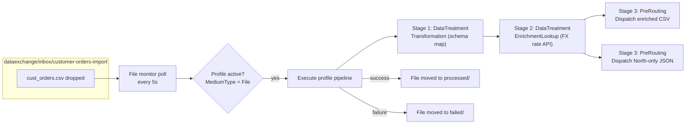

### 4.4 Complete profile example

Quoted verbatim from the test fixture in `StepFunctionsApp.Tests/DataExchangePipelineTests.cs` (the `__WORKDIR__` and `localhost:5095` values are test placeholders rewritten at runtime — use real paths/URLs in production):

```json
{
  "DataExchangeProfileName": "Customer Orders Import",
  "ProfileId": "customer-orders-import",
  "IsActive": true,
  "DataSource": {
    "DataSourceName": "cust_orders.csv",
    "MediumType": "File",
    "MediumConfigurationJson": "{\"filePath\": \"__WORKDIR__/cust_orders.csv\"}"
  },
  "Pipeline": {
    "PipelineName": "CustomerOrdersToInternal",
    "Description": "Map customer CSV to internal schema, enrich with NZD FX rate via lookup API, dispatch enriched set (CSV) and North-region subset (JSON).",
    "PipelineStages": [
      {
        "StageType": "DataTreatment",
        "ExecutionOrder": 1,
        "PipelineStageActions": [
          {
            "ExecutionOrder": 1,
            "Action": {
              "ActionName": "MapToInternalSchema",
              "Type": "Transformation",
              "SchemaMap": {
                "AttributeMappings": [
                  {
                    "TargetAttribute": { "AttributeName": "OrderNumber" },
                    "SourceAttributes": [{ "AttributeName": "OrderID" }],
                    "TransformType": "DirectCopy",
                    "MergeStrategy": "OverwriteExisting"
                  },
                  {
                    "TargetAttribute": { "AttributeName": "CustomerRef" },
                    "SourceAttributes": [{ "AttributeName": "CustomerCode" }],
                    "TransformType": "ToUpper",
                    "MergeStrategy": "OverwriteExisting"
                  },
                  {
                    "TargetAttribute": { "AttributeName": "RegionName" },
                    "SourceAttributes": [{ "AttributeName": "Region" }],
                    "TransformType": "DirectCopy",
                    "MergeStrategy": "OverwriteExisting"
                  },
                  {
                    "TargetAttribute": { "AttributeName": "AmountUSD" },
                    "SourceAttributes": [{ "AttributeName": "Amount" }],
                    "TransformType": "DirectCopy",
                    "MergeStrategy": "OverwriteExisting"
                  },
                  {
                    "TargetAttribute": { "AttributeName": "Currency" },
                    "SourceAttributes": [{ "AttributeName": "CurrencyCode" }],
                    "TransformType": "DirectCopy",
                    "MergeStrategy": "OverwriteExisting"
                  }
                ]
              }
            }
          }
        ]
      },
      {
        "StageType": "DataTreatment",
        "ExecutionOrder": 2,
        "PipelineStageActions": [
          {
            "ExecutionOrder": 1,
            "Action": {
              "ActionName": "EnrichWithNzdRate",
              "Type": "EnrichmentLookup",
              "OutputParameterName": "AmountNZD",
              "Lookup": {
                "LookupName": "fx-rate-nzd",
                "LookupEndpoint": "http://localhost:5095/api/fake/exchange-rate?from={Currency}&to=NZD&amt={AmountUSD}",
                "Type": "Api",
                "ValueFieldToReturn": "convertedAmount"
              }
            }
          }
        ]
      },
      {
        "StageType": "PreRouting",
        "ExecutionOrder": 3,
        "PipelineStageActions": [
          {
            "ExecutionOrder": 1,
            "Action": {
              "ActionName": "DispatchAllEnrichedCsv",
              "Type": "Dispatch",
              "Endpoint": { "ActionEndpointURL": "file://__WORKDIR__/out/enriched-orders.csv" },
              "Parameters": { "OutputFormat": "csv" }
            }
          },
          {
            "ExecutionOrder": 2,
            "Action": {
              "ActionName": "DispatchNorthOnlyJson",
              "Type": "Dispatch",
              "Endpoint": { "ActionEndpointURL": "file://__WORKDIR__/out/north-orders.json" },
              "Parameters": { "Filter": "\"RegionName\" = 'North'", "OutputFormat": "json" }
            }
          }
        ]
      }
    ]
  }
}
```

## 5. End-to-End Scenarios

Ten complete flows, each with a diagram and the full ASL JSON you would register via `POST /api/flows` (§1.4). All examples use PascalCase keys; the engine accepts camelCase too (Json.NET binding is case-insensitive — see §6.3).

### 5.1 Fetch an order, shape it with JSONata, route by size

A Task fetches from the API; `QueryLanguage: "JSONata"` at definition level makes the `ResultSelector` a JSONata expression that reshapes the response before routing.

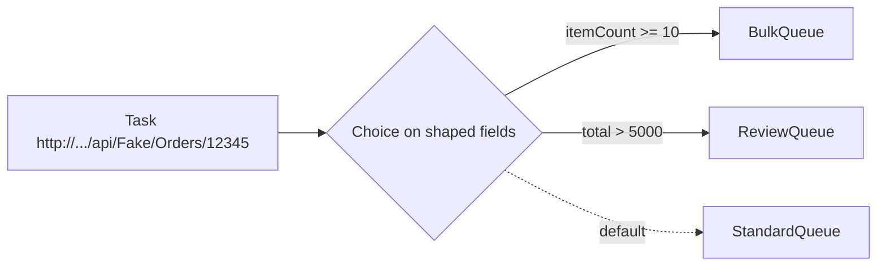

```json
{
  "Comment": "Fetch an order from the API, shape it with JSONata (QueryLanguage at definition level), and route by size.",
  "StartAt": "FetchOrder",
  "QueryLanguage": "JSONata",
  "States": {
    "FetchOrder": {
      "Type": "Task",
      "Resource": "http://localhost:5095/api/Fake/Orders/12345",
      "ResultSelector": "{ id: $.id, itemCount: count($.items), total: sum($.items.amount) }",
      "Next": "RouteBySize"
    },
    "RouteBySize": {
      "Type": "Choice",
      "Choices": [
        { "Variable": "$.itemCount", "NumericGreaterThanEquals": 10, "Next": "BulkQueue" },
        { "Variable": "$.total", "NumericGreaterThan": 5000, "Next": "ReviewQueue" }
      ],
      "Default": "StandardQueue"
    },
    "BulkQueue": { "Type": "Pass", "Next": "Done" },
    "ReviewQueue": { "Type": "Pass", "Next": "Done" },
    "StandardQueue": { "Type": "Pass", "Next": "Done" },
    "Done": { "Type": "Succeed" }
  }
}
```

### 5.2 AI ticket triage

An LLM classifies a support ticket; the flow routes on the model's JSON answer. The live ticket is bound in with `ticket.$` (see §3.4).

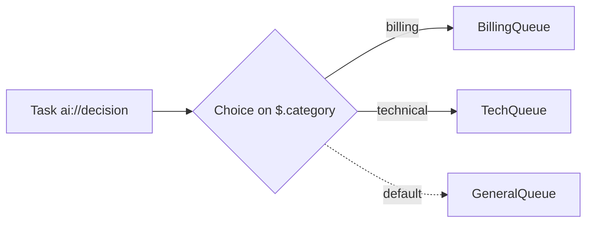

```json
{
  "Comment": "Classify a support ticket with an LLM and route it to the right queue.",
  "StartAt": "ClassifyTicket",
  "States": {
    "ClassifyTicket": {
      "Type": "Task",
      "Resource": "ai://decision",
      "Parameters": {
        "model": "gpt-4-turbo",
        "llmService": "azureOpenAI",
        "prompt": "Classify the support ticket in the 'ticket' field as billing, technical, or other. Respond with JSON {\"category\": \"...\"}.",
        "outputFormat": "json",
        "ticket.$": "$.ticket"
      },
      "Next": "RouteByCategory"
    },
    "RouteByCategory": {
      "Type": "Choice",
      "Choices": [
        { "Variable": "$.category", "StringEquals": "billing", "Next": "BillingQueue" },
        { "Variable": "$.category", "StringEquals": "technical", "Next": "TechQueue" }
      ],
      "Default": "GeneralQueue"
    },
    "BillingQueue": { "Type": "Pass", "Next": "Done" },
    "TechQueue": { "Type": "Pass", "Next": "Done" },
    "GeneralQueue": { "Type": "Pass", "Next": "Done" },
    "Done": { "Type": "Succeed" }
  }
}
```

### 5.3 NRules credit check with error guard

Always branch on `$.HasErrored` before trusting a rule verdict — a rule that throws is not the same as a rule that rejected (§3.6 result shapes).

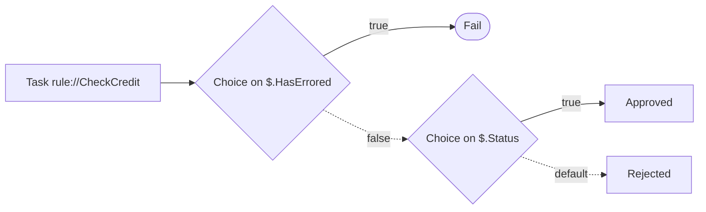

```json
{
  "Comment": "Run a registered NRules rule and guard against rule errors before trusting the verdict.",
  "StartAt": "CheckCredit",
  "States": {
    "CheckCredit": {
      "Type": "Task",
      "Resource": "rule://CheckCredit",
      "Parameters": {
        "score.$": "$.creditScore",
        "limit.$": "$.creditLimit"
      },
      "Next": "GuardErrors"
    },
    "GuardErrors": {
      "Type": "Choice",
      "Choices": [
        { "Variable": "$.HasErrored", "BooleanEquals": true, "Next": "RuleFailed" }
      ],
      "Default": "CheckVerdict"
    },
    "CheckVerdict": {
      "Type": "Choice",
      "Choices": [
        { "Variable": "$.Status", "BooleanEquals": true, "Next": "Approved" }
      ],
      "Default": "Rejected"
    },
    "RuleFailed": { "Type": "Fail", "Error": "RuleEngineError", "Cause": "Credit rule raised an error - see $.ErrorMessage" },
    "Approved": { "Type": "Pass", "Next": "Done" },
    "Rejected": { "Type": "Pass", "Next": "Done" },
    "Done": { "Type": "Succeed" }
  }
}
```

### 5.4 DuckDB batch: load, validate, flag

The same pattern as the converted SSIS flow in §6.3 — rows are loaded into a DuckDB table with `transform://query`, then corrected and flagged with `transform://execute` SQL.

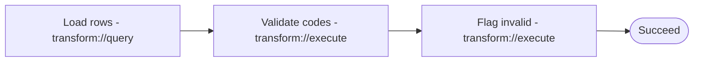

```json
{
  "Comment": "Load bank transactions into DuckDB, validate assessment numbers with CASE WHEN + REGEXP_MATCHES, and flag invalid rows. Modeled on Flows/REG_INT_BTP.json.",
  "StartAt": "LoadTransactions",
  "States": {
    "LoadTransactions": {
      "Type": "Task",
      "Resource": "transform://query",
      "Parameters": {
        "operation": "query",
        "table": "transactions",
        "data": [
          { "id": 1, "particulars": "rates", "code": "12345", "amount": 150.0, "valid": 0, "lineStatus": "unchecked" },
          { "id": 2, "particulars": "water", "code": "67890", "amount": 75.5, "valid": 0, "lineStatus": "unchecked" }
        ],
        "sql": "SELECT COUNT(*) AS loaded FROM transactions"
      },
      "Next": "ValidateRates"
    },
    "ValidateRates": {
      "Type": "Task",
      "Resource": "transform://execute",
      "Parameters": {
        "operation": "execute",
        "sql": "UPDATE transactions SET lineStatus = CASE WHEN REGEXP_MATCHES(code, '^[0-9]+$') AND code NOT LIKE '%.%' THEN 'unchecked' ELSE 'Invalid Assessment No.' END WHERE particulars = 'rates' AND valid = 0"
      },
      "Next": "FlagInvalidRates"
    },
    "FlagInvalidRates": {
      "Type": "Task",
      "Resource": "transform://execute",
      "Parameters": {
        "operation": "execute",
        "sql": "UPDATE transactions SET valid = 0, extracted = 0 WHERE particulars = 'rates' AND lineStatus = 'Invalid Assessment No.'"
      },
      "Next": "Done"
    },
    "Done": { "Type": "Succeed" }
  }
}
```

### 5.5 DataExchange profile in a flow

A Task with `dataexchange://<ProfileId>` runs the whole profile pipeline (source → treatment stages → dispatch) synchronously and reports at least `success`, `rowsIn` and `rowsOut` (§4). The alternative trigger — file drop into the watched directory — needs no flow at all (§4.3).

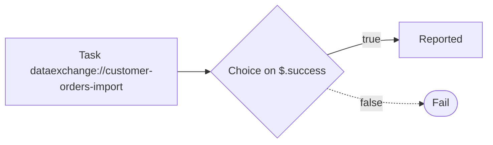

```json
{
  "Comment": "Run the customer-orders-import DataExchange profile synchronously from a flow and branch on its result.",
  "StartAt": "ImportOrders",
  "States": {
    "ImportOrders": {
      "Type": "Task",
      "Resource": "dataexchange://customer-orders-import",
      "Next": "CheckResult"
    },
    "CheckResult": {
      "Type": "Choice",
      "Choices": [
        { "Variable": "$.success", "BooleanEquals": true, "Next": "Reported" }
      ],
      "Default": "ImportFailed"
    },
    "Reported": { "Type": "Pass", "Next": "Done" },
    "ImportFailed": { "Type": "Fail", "Error": "DataExchangeFailed", "Cause": "Profile pipeline reported failure - see $.error" },
    "Done": { "Type": "Succeed" }
  }
}
```

### 5.6 Map over order lines

A Map state iterates `$.items`; each iteration runs the nested machine (the `Iterator`) against one item, up to `MaxConcurrency` at a time. Inside the iterator, `$` is the current item.

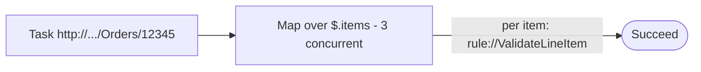

```json
{
  "Comment": "Fetch an order and validate every line item with a Map state; each iteration runs the nested machine against one item.",
  "StartAt": "FetchOrder",
  "States": {
    "FetchOrder": {
      "Type": "Task",
      "Resource": "http://localhost:5095/api/Fake/Orders/12345",
      "Next": "ValidateLines"
    },
    "ValidateLines": {
      "Type": "Map",
      "ItemsPath": "$.items",
      "MaxConcurrency": 3,
      "Iterator": {
        "StartAt": "CheckLine",
        "States": {
          "CheckLine": {
            "Type": "Task",
            "Resource": "rule://ValidateLineItem",
            "Parameters": { "line.$": "$" },
            "End": true
          }
        }
      },
      "Next": "Done"
    },
    "Done": { "Type": "Succeed" }
  }
}
```

### 5.7 Parallel validation chains

A Parallel state runs one nested machine per branch concurrently — the same shape as `Phase3_ParallelValidation` in the converted SSIS flow (§6.3).

```mermaid
flowchart TD
    P[Parallel - 3 branches] --> B1[rates chain]
    P --> B2[parking chain]
    P --> B3[water chain]
    B1 & B2 & B3 --> S([Succeed])
```

```json
{
  "Comment": "Validate three independent data domains in parallel; each branch is a nested state machine, mirroring Flows/REG_INT_BTP.json Phase3_ParallelValidation.",
  "StartAt": "ParallelValidation",
  "States": {
    "ParallelValidation": {
      "Type": "Parallel",
      "Branches": [
        {
          "Comment": "Chain: rates validation",
          "StartAt": "ValidateRates",
          "States": {
            "ValidateRates": {
              "Type": "Task",
              "Resource": "transform://execute",
              "Parameters": {
                "operation": "execute",
                "sql": "UPDATE transactions SET lineStatus = CASE WHEN REGEXP_MATCHES(code, '^[0-9]+$') THEN 'unchecked' ELSE 'Invalid Assessment No.' END WHERE particulars = 'rates'"
              },
              "End": true
            }
          }
        },
        {
          "Comment": "Chain: parking validation",
          "StartAt": "ValidateParking",
          "States": {
            "ValidateParking": {
              "Type": "Task",
              "Resource": "transform://execute",
              "Parameters": {
                "operation": "execute",
                "sql": "UPDATE transactions SET lineStatus = CASE WHEN REGEXP_MATCHES(code, '^[0-9]+$') AND code NOT LIKE '%.%' AND LENGTH(code) <= 7 THEN 'unchecked' ELSE 'Invalid Infringement No.' END WHERE particulars = 'parking'"
              },
              "End": true
            }
          }
        },
        {
          "Comment": "Chain: water validation",
          "StartAt": "ValidateWater",
          "States": {
            "ValidateWater": {
              "Type": "Task",
              "Resource": "transform://execute",
              "Parameters": {
                "operation": "execute",
                "sql": "UPDATE transactions SET lineStatus = CASE WHEN REGEXP_MATCHES(code, '^[0-9]+$') THEN 'unchecked' ELSE 'Invalid Account No.' END WHERE particulars = 'water'"
              },
              "End": true
            }
          }
        }
      ],
      "Next": "Done"
    },
    "Done": { "Type": "Succeed" }
  }
}
```

### 5.8 SSH maintenance + SFTP file retrieval

Run a command on a registered host (`ssh://<host>`), branch on `$.exitCode`, then pull the resulting files back with `fetch://` (§3.10, §3.11).

```mermaid
flowchart LR
    T[Task ssh://backup-host] --> C{Choice on $.exitCode}
    C -->|0| F2[Task fetch://web-01 proto=sftp]
    C -.->|non-zero| X([Fail])
    F2 --> C2{Choice on $.fileCount}
    C2 -->|> 0| S([Succeed])
    C2 -.->|none| Y([Fail])
```

```json
{
  "Comment": "Run a maintenance command over SSH on a registered host, then pull the log files back over SFTP.",
  "StartAt": "RunMaintenance",
  "States": {
    "RunMaintenance": {
      "Type": "Task",
      "Resource": "ssh://backup-host",
      "Parameters": {
        "command": "/opt/maintenance/rotate-logs.sh",
        "timeoutSeconds": 120
      },
      "Next": "CheckExit"
    },
    "CheckExit": {
      "Type": "Choice",
      "Choices": [
        { "Variable": "$.exitCode", "NumericEquals": 0, "Next": "FetchLogs" }
      ],
      "Default": "MaintenanceFailed"
    },
    "FetchLogs": {
      "Type": "Task",
      "Resource": "fetch://web-01?proto=sftp",
      "Parameters": {
        "sourcePath": "/var/log/maintenance/",
        "destDir": "collected-logs"
      },
      "Next": "CheckFiles"
    },
    "CheckFiles": {
      "Type": "Choice",
      "Choices": [
        { "Variable": "$.fileCount", "NumericGreaterThan": 0, "Next": "Done" }
      ],
      "Default": "NoLogsFetched"
    },
    "MaintenanceFailed": { "Type": "Fail", "Error": "SshNonZeroExit", "Cause": "Command exited non-zero - see $.stderr" },
    "NoLogsFetched": { "Type": "Fail", "Error": "FetchEmpty", "Cause": "No files returned from remote host" },
    "Done": { "Type": "Succeed" }
  }
}
```

### 5.9 Human approval gate

A HumanTask suspends the flow until a person completes it — via `POST /api/human-tasks/{id}/complete` (shown below) or by dropping `{taskId}.json` into the watched directory (§3.3). The completion result is merged at `ResultPath`.

```mermaid
flowchart LR
    H[HumanTask - suspends] -->|completion arrives| C{Choice on $.approval.approved}
    C -->|true| P[ProcessRefund]
    C -.->|default| F([Fail])
```

```json
{
  "Comment": "Suspend for human approval; resume via POST /api/human-tasks/{id}/complete and branch on the verdict.",
  "StartAt": "AwaitApproval",
  "States": {
    "AwaitApproval": {
      "Type": "HumanTask",
      "Next": "CheckVerdict",
      "ResultPath": "$.approval",
      "Task": { "title": "Approve refund for order $.order.id", "assignee": "finance-team" },
      "Completion": { "Type": "api" }
    },
    "CheckVerdict": {
      "Type": "Choice",
      "Choices": [
        { "Variable": "$.approval.approved", "BooleanEquals": true, "Next": "ProcessRefund" }
      ],
      "Default": "DenyRefund"
    },
    "ProcessRefund": { "Type": "Pass", "Next": "Done" },
    "DenyRefund": { "Type": "Fail", "Error": "ApprovalDenied", "Cause": "Refund approval was denied" },
    "Done": { "Type": "Succeed" }
  }
}
```

Completing the task from a terminal:

```bash
curl -X POST http://localhost:5001/api/human-tasks/{taskId}/complete \
  -H "Content-Type: application/json" \
  -d '{"approved": true, "notes": "OK to refund"}'
```

### 5.10 Composite order pipeline (kitchen sink)

One flow combining four schemes: `http://` fetch → `transform://` DuckDB staging → `rule://` credit check → file-drop `HumanTask` approval before dispatch.

```mermaid
flowchart LR
    F[Task http://.../Orders] --> D[Stage in DuckDB - transform://query]
    D --> R[Credit check - rule://CheckCredit]
    R --> G{Choice on $.HasErrored}
    G -.->|false| H[HumanTask - file drop approval]
    G -->|true| X([Fail])
    H --> P[Dispatch - http://.../Payments/submit]
    P --> S([Succeed])
```

```json
{
  "Comment": "Full pipeline: fetch the order, stage it in DuckDB, run credit rules, then gate on a file-drop approval before dispatch.",
  "StartAt": "FetchOrder",
  "States": {
    "FetchOrder": {
      "Type": "Task",
      "Resource": "http://localhost:5095/api/Fake/Orders/12345",
      "Next": "StageInDuckDb"
    },
    "StageInDuckDb": {
      "Type": "Task",
      "Resource": "transform://query",
      "Parameters": {
        "operation": "query",
        "table": "orders_staging",
        "data.$": "$.items"
      },
      "Next": "CheckCredit"
    },
    "CheckCredit": {
      "Type": "Task",
      "Resource": "rule://CheckCredit",
      "Parameters": { "score.$": "$.creditScore" },
      "Next": "GuardErrors"
    },
    "GuardErrors": {
      "Type": "Choice",
      "Choices": [
        { "Variable": "$.HasErrored", "BooleanEquals": true, "Next": "RuleFailed" }
      ],
      "Default": "AwaitApproval"
    },
    "AwaitApproval": {
      "Type": "HumanTask",
      "Next": "Dispatch",
      "ResultPath": "$.approval",
      "Task": { "title": "Release staged order to payments", "assignee": "ops-team" },
      "Completion": { "Type": "file", "Directory": "approvals-inbox" }
    },
    "Dispatch": {
      "Type": "Task",
      "Resource": "http://localhost:5095/api/Fake/Payments/submit",
      "Parameters": { "order.$": "$.items" },
      "Next": "Done"
    },
    "RuleFailed": { "Type": "Fail", "Error": "RuleEngineError", "Cause": "Credit rule raised an error" },
    "Done": { "Type": "Succeed" }
  }
}
```

## 6. Migration — SSIS Packages

### 6.1 What the converter does

`Converters/` contains the pipeline that converts SSIS packages into StepFlow state machines (quoted verbatim from `Converters/README.md`):

> This directory contains tools and resources for converting SSIS packages into Step Functions workflows.

The pipeline, verbatim from the README:

```text
+---------------------------------------------------------+
| Conversion Pipeline |
| |
| +--------------+ +--------------+ +------------+ |
| | SSIS Package |--| Pattern Match |--| State Map | |
| | (XML) | | Registry | | Definition | |
| +--------------+ +--------------+ +------------+ |
| |
| +--------------+ +--------------+ +------------+ |
| | Manifest |--| Builder |--| Resources | |
| | Tracking | | Execution | | Patterns | |
| +--------------+ +--------------+ +------------+ |
+---------------------------------------------------------+
```

Components:

- **`ResourceRegistry.cs`** — "Centralized resource definitions for all available services" (verbatim), including `transform://` DuckDB data transformations.
- **`ConversionBuilder.cs`** — builds the conversion; its API surface is shown in §6.2.
- **`ConversionManifest.json`** — records what was mapped, how to validate it, and how to roll back (§6.2).

### 6.2 Step-by-step procedure

1. Place the `.dtsx` package where the builder can read it (e.g., `Flows/`).
2. Run the build — verbatim from the README's "Example Conversion Flow":

```csharp
// Step 1: Build conversion
var result = ConversionBuilder.Build("REG_INT_BTP.dtsx", "bank-processing-v1");

// Step 2: Validate result
if (result.Success) {
 // Step 3: Save workflow
 File.WriteAllText(
 "output.json",
 result.WorkflowJson
 );

 // Step 4: Update manifest
 File.WriteAllText(
 "conversion_manifest.json",
 JsonSerializer.Serialize(result.Mappings)
 );
}
```

3. Inspect the manifest before deploying. Each mapping records what happened to one SSIS task (verbatim from `Converters/ConversionManifest.json`):

```json
{
  "OriginalTaskName": "LoadTransactionData",
  "ConvertedStateId": "LoadTransactionData",
  "ResourceUsed": "transform://query",
  "DataSchema": "operation:string, table:string, data:array",
  "TransformationLogic": "SQL-based transformation",
  "RequiresApproval": false
}
```

   The manifest also carries a `RollbackInfo` block with a ready-to-run restore command (verbatim):

```text
"OriginalVersion": "1.0.0",
"RestoreCommand": "Copy-Item 'C:\\Source\\200--INTERFACES--BankFiletoAuthorityPaymentsFilev1\\REG_INT_BTP.dtsx' -Destination '.\\original_packages' -Force",
"ValidationCheck": "Compare-Object -ReferenceObject (Import-Csv 'manifest.json') -DifferenceObject (Get-Content 'converted.json')"
```

4. Validate before deployment: register the converted flow via `POST /api/flows` (§1.4) and run a representative payload through `POST /api/flows/execute/{id}`; compare behaviour against the original package using the manifest's `ValidationCheck`.

### 6.3 Walkthrough — Flows/REG_INT_BTP.json (converted output)

The repo contains a real conversion: SSIS package `REG_INT_BTP.dtsx` → `Flows/REG_INT_BTP.json`. Excerpts below are quoted verbatim from that file; because they are fragments (with `// elided` markers where content was cut), they are shown as plain text rather than JSON. Header comment, verbatim:

```text
"comment": "REG_INT_BTP - Bank File to Authority Payments File v1\n Converted from SSIS package: REG_INT_BTP.dtsx\n Orchestrates bank transaction processing with data corrections, validations, and matching.",
```

**Casing note.** The converter emits camelCase keys (`type`, `resource`, `parameters`); the engine's Json.NET binding is case-insensitive, so converted flows run as-is. This guide standardizes on PascalCase (§1.2).

The first state loads sample rows into DuckDB (verbatim; data rows elided):

```text
"LoadTransactionData": {
  "type": "Task",
  "comment": "Load sample bank transactions into DuckDB for processing",
  "resource": "transform://query",
  "next": "LoadReferenceData",
  "parameters": {
    "operation": "query",
    "table": "transactions",
    "data": [ // elided: sample data rows
```

Validation runs as SQL against the DuckDB table — this state marks rates with invalid assessment numbers (verbatim):

```text
"FlagInvalidRates": {
  "type": "Task",
  "comment": "Mark rates with invalid assessment numbers",
  "resource": "transform://execute",
  "end": true,
  "parameters": {
    "operation": "execute",
    "sql": "UPDATE transactions SET valid = 0, extracted = 0 WHERE particulars = 'rates' AND lineStatus = 'Invalid Assessment No.'"
  }
}
```

Independent validation domains run concurrently in a Parallel state (excerpt; chain 1 and chains 3–5 elided):

```text
"Phase3_ParallelValidation": {
  // elided: "type": "Parallel" and surrounding fields
  "branches": [
    // elided: Chain 1 (rates)
    {
      "comment": "Chain 2: Parking validation",
      "startAt": "ValidateParking",
      "states": {
        "ValidateParking": {
          "type": "Task",
          "comment": "Check parking infringement number - ISNUMERIC, no dots, max 7 chars",
          "resource": "transform://execute",
          "next": "FlagInvalidParking",
          "parameters": {
            "operation": "execute",
            "sql": "UPDATE transactions SET lineStatus = CASE WHEN REGEXP_MATCHES(code, '^[0-9]+$') AND code NOT LIKE '%.%' AND LENGTH(code) <= 7 THEN 'unchecked' ELSE 'Invalid Infringement No.' END WHERE particulars = 'parking' AND valid = 0 AND extracted = 0"
          }
        },
        // elided: FlagInvalidParking state
      }
    }
    // elided: Chains 3-5 (water, animal, general ledger) - same shape
  ]
}
```

### 6.4 SSIS concept → StepFlow mapping

Guidance for tasks the converter does not map automatically (the converter's own mappings are recorded per-task in the manifest):

|SSIS construct|StepFlow equivalent|Notes|
|---|---|---|
|Data Flow task with OLE DB sources/transforms|Task `transform://query` / `transform://execute` (§3.7)|rows loaded via `data`, shaped by SQL|
|ADO.NET command task|Task `transform://execute` with `sql`|single statement per state|
|Script task (C#/VB)|Task `transform://<language>` script or a registered rule|§3.8, §3.6|
|Precedence constraints|Choice state rules + `Default` (§3.2)|evaluate in order; first match wins|
|For Each loop over rows|Map state with `ItemsPath` + `Iterator` (§3.2)|nested machine per item|
|Parallel container / split paths|Parallel state branches (§3.2)|one nested machine per branch|
|HTTP call (custom script)|Task `http(s)://` resource (§3.5)|method/body/headers via Parameters|
|Package-level variables|State context: bind with `"name.$": "$.path"` and merge results at `ResultPath`|flows are immutable per execution — there is no mutable variable store|

## 7. Migration — Azure Logic Apps

No automated converter exists for Logic App definitions; port them manually. The mapping below covers the standard action set.

### 7.1 Action mapping table

|Logic Apps construct|StepFlow equivalent|Notes|
|---|---|---|
|HTTP Request action|Task with `http(s)://` resource (§3.5)|method/body/headers via Parameters|
|Condition|Choice state (§3.2)|each branch = one choice rule; else = `Default`|
|For Each|Map state (§3.2)|`ItemsPath` + nested `Iterator` machine|
|Parallel Branch|Parallel state (§3.2)|one branch per ParallelBranches entry|
|Delay|Wait state with `Seconds` (§3.9)||
|Approval|HumanTask (§3.3)|api completion = `POST /api/human-tasks/{id}/complete`; file drop as alternative|
|Function App action|Task `http(s)://` to the function URL, or `tool://` if registered as a tool||
|Sub-workflow (call another Logic App)|Task `flow://<name>` (§3.12)|child flow must be registered first|
|Recurrence / timer trigger|External scheduler hitting `POST /api/flows/execute/{id}` (§1.4)|the engine has no built-in cron|
|Variables|State context: `"name.$": "$.path"` bindings + `ResultPath` merges|no mutable variable store — pass data through the input object|
|LA expressions|JSONPath templates, or `QueryLanguage: "JSONata"` at definition level (§5.1)||

### 7.2 Step-by-step procedure

1. Export the Logic App definition (ARM template `properties.workflowDefinition`, or the portal export).
2. Inventory actions in trigger order; for each, note its inputs and where its outputs are consumed downstream.
3. Map every action via §7.1. Anything unmapped (custom connectors) becomes an `http(s)://` call to the connector's backend or a manual reimplementation as a Task resource.
4. Build the ASL: one state per action; wire `Next`/`Choices`/`Branches` from the Logic App graph; replace expression references with JSONPath/JSONata against the running input (§5.1).
5. Register via `POST /api/flows` (§1.4) and test with a representative payload through `POST /api/flows/execute/{id}`.
6. Replace the trigger: point the external scheduler — or a DataExchange file drop (§4.3) — at the new flow's execute route; decommission the Logic App after a parallel run.

### 7.3 Worked example — small Logic App ported

A Logic App with an HTTP trigger, an HTTP action (fetch order), a Condition (`status == 'paid'`), and a 5-second Delay becomes:

```mermaid
flowchart LR
    F[Task http://.../Orders/12345] --> C{Choice on $.status}
    C -->|paid| W[/Wait 5s/]
    C -.->|default| D([Succeed])
    W --> D
```

```json
{
  "Comment": "Port of a Logic Apps workflow: fetch an order, wait if paid, then finish.",
  "StartAt": "FetchOrder",
  "States": {
    "FetchOrder": {
      "Type": "Task",
      "Resource": "http://localhost:5095/api/Fake/Orders/12345",
      "Next": "IsPaid"
    },
    "IsPaid": {
      "Type": "Choice",
      "Choices": [
        { "Variable": "$.status", "StringEquals": "paid", "Next": "SettleLater" }
      ],
      "Default": "Done"
    },
    "SettleLater": { "Type": "Wait", "Seconds": 5, "Next": "Done" },
    "Done": { "Type": "Succeed" }
  }
}
```
