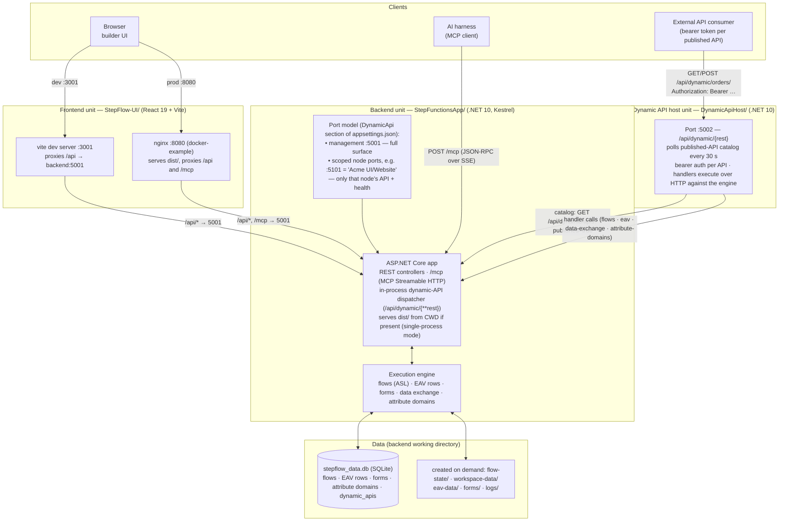
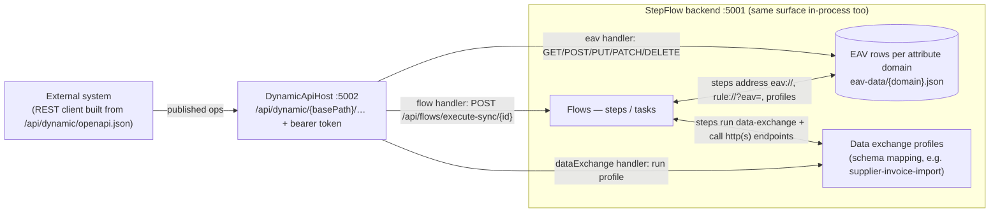

# StepFlow Builder — Architecture

StepFlow Builder is a visual builder for serverless-style flows (ASL) plus an EAV data layer, forms, and a dynamic REST API surface. It ships as **three independently deployable units** that share one backend database:

| Unit | Path | Tech | Default port | Role |
|---|---|---|---|---|
| Backend / execution engine | `StepFunctionsApp/` | ASP.NET Core (.NET 10) | 5001 (management) + per-node ports | Owns all state; runs flows, EAV rows, forms, data exchange; exposes REST controllers, MCP endpoint, and the dynamic API dispatcher in-process |
| Dynamic API host | `DynamicApiHost/` | ASP.NET Core (.NET 10) | 5002 | External twin of the in-process dispatcher: serves only *published* dynamic APIs with per-API bearer auth; executes handlers over HTTP against the backend engine |
| Frontend (builder UI) | `StepFlow-UI/` | React 19 + Vite SPA | 3001 (dev) / static build | Visual flow builder, EAV/data-exchange editors, dynamic API panel. All calls are hardcoded relative `/api/*` — **same-origin only** |

Shared library: `StepFlow.DynamicApi.Core/` — route matching, bearer auth, and input merging used by both the backend's in-process dispatcher and DynamicApiHost, so the two surfaces behave identically.

## Architecture diagram



## How the parts fit together

### Backend = engine of record
Everything stateful lives in the backend. SQLite (`stepflow_data.db`) holds flows, EAV rows, forms, attribute domains, and the `dynamic_apis` catalog; disk providers under the working directory hold flow execution state, workspace tree, and logs (created on demand).

Kestrel binding is driven by its own `DynamicApi` config section — **not** `UseUrls`/`ASPNETCORE_URLS`:
- `ManagementPort` (5001) — full surface: builder UI, all REST controllers, `/mcp`, and every dynamic API.
- `ListenAddress` (`localhost` | `*` | IP literal) — applied to all bound ports; set `*` for cross-host/container deployments.
- `Endpoints[]` — optional **scoped node ports**, e.g. `{ "Port": 5101, "NodePath": "Acme UI/Website" }`. Each such port serves only `/api/health` plus the dynamic API surface of that workspace-node subtree; everything else is 404. This is the multi-tenant scoping mechanism: one TCP port per business unit / project domain (see `StepFunctionsApp/deploy/nginx-stepflow.conf`).

Operator views on the management port:
- `GET /api/health` — liveness + flow-state store status.
- `GET /api/dynamic/openapi.json` — OpenAPI for all dynamic APIs (scoped to the node when called on a scoped port).
- `GET /api/dynamic/endpoints` — port → node binding table, an NGINX config authoring aid.

### Dynamic API host = external twin of the dispatcher
The backend already dispatches `/api/dynamic/{**rest}` in-process (management port). DynamicApiHost exists to expose **published** dynamic APIs on a separate surface without exposing management endpoints:
1. Polls `GET {Engine.BaseUrl}/api/dynamic/apis?published=true` every 30 s (`Sync.IntervalSeconds`) and keeps the catalog in memory — self-heals if it starts before the backend.
2. Matches incoming `/api/dynamic/{rest}` against the catalog (same matching code as the backend, via `StepFlow.DynamicApi.Core`).
3. Requires the per-API bearer token; then executes the handler **over HTTP** against the engine:

|Handler type|Engine endpoint called|
|---|---|
|`flow`|`POST /api/flows/execute-sync/{id}`|
|`eav`|incoming method (GET/POST/PUT/PATCH/DELETE) forwarded to `/api/eav/{domain}/rows[/{rowKeyId}]`, query string verbatim|
|`dataExchange`|`POST /api/data-exchange/execute`|
|`attributeDomain`|`GET /api/attribute-domains/{name}` or `POST /api/attribute-domains` (create)|

### Frontend = same-origin SPA
The UI hardcodes relative `/api/*` paths everywhere (no env var, no baseURL). It must therefore be served **from the backend's origin** or behind a reverse proxy that forwards `/api` to it:
- Dev: vite dev server on :3001 proxies `/api` → `localhost:5001`.
- Docker showcase: nginx serves `dist/` and proxies `/api` + `/mcp` → backend.
- Single-process mode: copy `dist/` next to the backend binary — it is served from CWD automatically, so UI + API share :5001 with no proxy at all.

## Data integration loop

The dynamic API surface is not only an output of flows — it is also an input. The same EAV layer that flow steps write to can be written directly by any external system, and published APIs can trigger flows or run data-exchange profiles:



- **Inbound (external → StepFlow):** a published `eav` operation lets any external system CRUD rows in any attribute domain; a `flow` operation is effectively a webhook entry point that kicks off flow execution; a `dataExchange` operation runs a mapping profile so the outside world's schema becomes your internal one.
- **Outbound / inside flows:** steps address resources by URI — `eav://<domain>` gives read/write/update/patch/delete on rows, `rule://?eav=<entity>` maps a payload to the entity's typed attribute contract (`EavMapper`), and steps also run data-exchange profiles and call external HTTP endpoints.
- **Any schema:** every attribute domain is an addressable EAV entity (domains win over legacy `eav_registry.json` on collision); attributes are typed string/number/boolean/date, anything else passes through as JSON text — no type ceiling.

### Example — capturing JSON via POST, reading back with GET

The sample DB ships a published API that demonstrates exactly this: "Orders API" (basePath `/orders`, domain `OrderApproval`, bearer token set in the UI). Its two operations are both `eav` handlers on the same domain:

```json
[
  { "method": "GET",  "path": "", "handlerType": "eav", "domainName": "OrderApproval" },
  { "method": "POST", "path": "", "handlerType": "eav", "domainName": "OrderApproval" }
]
```

**1. POST captures JSON → row in a file.** The external client posts any JSON object to the published URL; the eav handler forwards the raw body to `POST /api/eav/OrderApproval/rows`, which appends a row: top-level `entityId`/`entityType` become row fields, everything else is captured as values.

```powershell
curl -X POST http://localhost:5002/api/dynamic/orders `
  -H "Authorization: Bearer <token from the API panel>" `
  -H "Content-Type: application/json" `
  -d '{"orderId":"ORD-9001","customerName":"Contoso","amount":1234.56,"priority":"High"}'
# → 201 Created, echoing the stored row
```

The row is persisted immediately to `eav-data/OrderApproval.json` in the backend's working directory — one JSON array per attribute domain:

```json
{
  "RowKeyId": "…",            // GUID (no dashes), assigned when the row is created
  "EntityId": null,           // from top-level entityId in the POST body, if present
  "EntityType": null,         // from top-level entityType, if present
  "SourceTaskId": null,       // stays null for direct API capture; set by human-task/form capture
  "CapturedAtUtc": "…",
  "Values": { "orderId": "ORD-9001", "customerName": "Contoso", "amount": 1234.56, "priority": "High" }
}
```

**2. GET reads it back.** The same URL with the bearer token returns all rows for the domain in append order; the full query language applies — any field as an equality filter, `sort=capturedAtUtc,-entityId`, `page`/`limit`/`offset`, `fields=a,b` projection (see docs/Dynamic-API.md):

```powershell
curl http://localhost:5002/api/dynamic/orders -H "Authorization: Bearer <token>"
# → 200 { "rows": [ … ], "count": N } — including the row just POSTed
```

The same surface is available on the management port (`http://localhost:5001/api/eav/OrderApproval/rows`) without bearer auth for local tooling; PUT/PATCH/DELETE by `{rowKeyId}` complete the CRUD. Flow steps can then consume these rows via `eav://` — so data captured from the outside world is directly usable inside tasks.

## Deploying in parts

### 1. Backend alone
```powershell
dotnet publish StepFunctionsApp/StepFunctionsApp.csproj -c Release -o out/backend
Copy-Item StepFunctionsApp/stepflow_data.db out/backend/   # sample workspace data (optional)
cd out/backend; dotnet StepFunctionsApp.dll
# verify: http://localhost:5001/api/health  →  {"status":"healthy"}
```
Config knobs (env vars, `__` = section separator):
- `DynamicApi__ManagementPort=6000` — move the management port.
- `DynamicApi__ListenAddress=*` — open all ports to other hosts/containers.
- Scoped node ports: `DynamicApi__Endpoints:0:Port=5101`, `DynamicApi__Endpoints:0:NodePath="Acme UI/Website"`.

### 2. Dynamic API host alone
```powershell
dotnet publish DynamicApiHost/DynamicApiHost.csproj -c Release -o out/dah
cd out/dah; dotnet DynamicApiHost.dll --urls http://+:5002
# point it at the backend:
$env:Engine__BaseUrl = "http://<backend-host>:5001"   # or edit appsettings.json
```
Gotcha: `DynamicApiHost/appsettings.json` pins `"Urls": "http://localhost:5002"`, and a config-file key **beats** the `ASPNETCORE_URLS` env var in .NET 10 URL resolution. Use the command-line `--urls http://+:5002` (highest precedence) to open the port for container/cross-host networking — that is what `docker-example/docker-compose.yml` does.

### 3. Frontend alone
```powershell
cd StepFlow-UI; npm ci; npm run build   # → StepFlow-UI/dist/
```
`dist/` is plain static files, but because of the same-origin constraint it needs one of:
- copy `dist/` into the backend's working directory (single-process mode), or
- any static host + reverse proxy forwarding `/api` to the backend (the nginx pattern in `docker-example/deploy/nginx.conf`).

### 4. Combinations
| Mode | What runs | URLs |
|---|---|---|
| Local dev (`.\start.ps1`) | backend :5001 (+ scoped ports from appsettings, e.g. :5101) · fake test API host `Stepflow-Builder-Tests` :5095 (target of `Flows/FakeData_*.json`) · vite :3001 | http://localhost:3001/ |
| Single process | backend with `dist/` in CWD | http://localhost:5001/ |
| Docker showcase (`docker-example/`) | nginx :8080 (SPA + `/api`,`/mcp` proxy) · backend :5001 · dynamic-api host :5002 — one compose network, no host ports needed between them | http://localhost:8080/, `:5001/api/health`, `:5002/api/dynamic/orders/` (bearer) |
| Multi-tenant scoping | backend with `DynamicApi__Endpoints` entries + per-domain nginx server blocks (`StepFunctionsApp/deploy/nginx-stepflow.conf`) — each business-unit domain routes to its node's port, so consumers see only that node's API surface | one domain per workspace node |

## Port reference

| Port | Process | Purpose |
|---|---|---|
| 3001 | vite dev server | UI in development; proxies `/api` → :5001 |
| 5001 | backend (management) | full surface: UI, controllers, `/mcp`, all dynamic APIs |
| 5095 | fake test API host (`Stepflow-Builder-Tests`) | dev-only target for `Flows/FakeData_*.json` |
| 5002 | DynamicApiHost | published dynamic APIs only (bearer auth) |
| 8080 | nginx (docker-example) | SPA + `/api`, `/mcp` proxy in the showcase stack |
| 5101 | backend (scoped node port, sample) | "Acme UI/Website" subtree API surface + health only |
